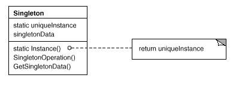

# 3.1. Módulo Padrões de Projeto GoFs Criacionais

## 3.1.1. Introdução

Padrões de projeto criacionais tratam da criação de objetos de forma controlada e desacoplada, promovendo flexibilidade na instanciação e permitindo que o sistema seja independente de como seus objetos são compostos e representados. O resultado prático é um sistema mais modular, adaptável e fácil de manter.<a href="#REF1">[1]</a>

Esses padrões encapsulam a lógica de criação, facilitando a evolução do sistema. Com essa separação, a introdução de novos objetos ou ajustes de configuração deixa de exigir mudanças espalhadas pelo código, tornando a solução mais resiliente e legível.<a href="#REF2">[2]</a>

## Participantes

Tabela 1: Participantes

| Nome | Função | Data | Horário |
| --- | --- | --- | --- |
| Ana Carolina Madeira Fialho | ### | ### | ### |
| Davi Monteiro de Negreiros | GoF Criacional - Factory Method | 21/05 | 23:21 |
| Gabriel Santos Pinto | ### | ### | ### |
| Guilherme Flyan | ### | ### | ### |
| João Marcelo Guimarães Costa Naves | GoF Criacional - Singleton | 21/05 | 14:00 |
| Maria Samara | GoF Criacional - Singleton | 21/05 | 21:00 |
| Marjorie Mitzi | ### | ### | ### |
| Pedro Henrique Pereira Santos | GoF Criacional - Singleton | 21/05 | 14:00 |
| Raissa Silva de Oliveira | GoF Criacional - Singleton | 21/05 | 14:00 |
| Yasmin Dayrell Albuquerque| GoF Criacional - Singleton / Factory Method | 20/05 | 15:00 |

## 3.1.2. Metodologia

O estudo dos Padrões de Projeto Criacionais foi conduzido com uma abordagem prática e colaborativa, priorizando a aplicação dos conceitos em um sistema de software real.

### 3.1.2.1. Revisão e Seleção de Padrões

O estudo foi iniciado com a revisão do catálogo de Padrões de Projeto Criacionais da "Gang of Four" (GoF), conforme apresentado na seção anterior. A partir desse levantamento, foi selecionado o Singleton para resolver o problema de criação compartilhada da instância do Supabase no frontend do MinhaTirinha, cujo código-fonte está hospedado em um repositório separado.

### 3.1.2.2. Aplicação e Implementação

O padrão Singleton foi implementado diretamente no código-fonte do frontend do MinhaTirinha. Essa etapa foi essencial para validar a eficácia do padrão na centralização da instância do Supabase, na melhoria da legibilidade do código e no aumento da consistência do sistema ao longo dos fluxos de autenticação, upload e atualização de dados.

### 3.1.2.3. Modelagem e Documentação UML

Para documentar visualmente a estrutura e a aplicação do padrão, o diagrama UML (Linguagem de Modelagem Unificada) foi elaborado com o Draw.io. O diagrama produzido, principalmente de classe, mapeia as interações e relações entre os elementos do frontend resultantes da aplicação do Singleton.

### 3.1.2.4. Demonstração e Colaboração

Para garantir a transparência do processo e registrar a contribuição de cada membro, as sessões de desenvolvimento, discussões técnicas e demonstrações de código foram gravadas via Microsoft Teams. Esses registros funcionam como artefatos de evidência, documentando a aplicação prática do padrão, o fluxo colaborativo de trabalho e a participação individual da equipe na resolução dos problemas de design.

## 3.1.3. Singleton

Singleton é um padrão de projeto criacional que possui os seguintes objetivos de acordo com a literatura classica: 

*__"Garantir que uma classe tenha somente uma instância e fornecer um ponto global de acesso para a mesma."__ (GAMMA, HEL, JOHNSON, VLISSIDES - Padrões de Projeto).*

A seguinte imagem, também baseada na literatura clássica, representa a implementação de uma classe singleton na notação de Diagrama de Classes UML:

 

*Fonte: GAMMA, HEL, JOHNSON, VLISSIDES - Padrões de Projeto* 

*Redigido por [Guilherme Flyan](https://www.github.com/GFlyan) e [João Marcelo](https://www.github.com/JoaoMarceloGCN).*

## 3.1.3.1. Aplicação do Singleton no Frontend

No frontend do MinhaTirinha localizado no nó client conforme o diagrama de implantação, essa instância única é o cliente Supabase exportado pelo módulo `source/mobile/utils/supabase.ts`.

O padrão GoF Criacional Singleton foi aplicado ao frontend do projeto, conforme o diagrama anexado pelo grupo.

Fonte: [João Marcelo Guimarães Costa Naves](https://github.com/JoaoMarceloGCN), [Pedro Henrique Pereira Santos](https://github.com/pedrohpsantos), [Raissa Silva de Oliveira](https://github.com/daisha19), 2026.

#### Estrutura e Responsabilidades

- **`source/mobile/utils/supabase.ts`**
  - Centraliza `supabaseUrl` e `supabaseKey`.
  - Cria a instância com `createClient(...)`.
  - Exporta `supabase` como cliente único do frontend.

- **`supabase: SupabaseClient`**
  - Instância compartilhada reutilizada por importação.
  - Concentra autenticação, storage e acesso ao banco.

- **`GoogleButton`**
  - Componente de login que usa `supabase.auth.signInWithIdToken(...)`.
  - Representa o uso do Singleton no fluxo de autenticação com Google.

- **`ColorPicker` e `SaveCommand`**
  - Reutilizam a mesma instância para upload da imagem, obtenção da URL pública e atualização do registro em `Historic`.
  - Também usam a instância no fluxo de reversão da operação.

#### Benefícios da Aplicação

**Centralização da configuração:** o cliente Supabase fica em um único módulo.

**Reuso da mesma instância:** as telas e componentes importam o mesmo objeto já configurado.

**Fluxo previsível:** autenticação, storage e banco seguem o mesmo ponto de acesso.

**Menor risco de divergência:** evita múltiplas instâncias com configurações diferentes no frontend.

**Manutenção simplificada:** qualquer ajuste de configuração do Supabase é feito em um único local.

Esse modelo demonstra a aplicação estruturada do padrão criacional Singleton no frontend do MinhaTirinha, com foco exclusivo na instância compartilhada do Supabase.

### 3.1.3.1.1. Opiniões dos Participantes

A elaboração desta etapa foi realizada de forma colaborativa em reunião pelo Microsoft Teams, onde os três membros designados estiveram presentes e participaram ativamente das discussões. O desenvolvimento do código foi conduzido no Android Studio, enquanto a criação da UML foi feita no Draw.io, ferramenta que permitiu a edição simultânea do diagrama e garantiu alinhamento entre os integrantes durante o processo.

Ao longo da atividade, cada membro contribuiu com ideias e feedbacks que ajudaram a consolidar um resultado coerente com a visão do grupo. Esse processo coletivo favoreceu tanto a consistência do diagrama quanto o fortalecimento da colaboração na equipe.

  
<strong><a href="https://github.com/daisha19">Raissa Silva de Oliveira</a></strong>

  
No início, o Singleton parecia algo simples demais, porque a ideia de manter uma única instância compartilhada não chama tanta atenção no dia a dia. Só que, ao olhar para o frontend, ficou claro que essa centralização era importante para não espalhar a configuração do Supabase em vários lugares. Assim, o login, o upload de imagens e a atualização dos dados passaram a usar o mesmo cliente, o que deixou a aplicação mais consistente.

  
<strong><a href="https://github.com/JoaoMarceloGCN">João Marcelo Guimarães Costa Naves</a></strong>

  
De início, pensei que importar o cliente diretamente em cada componente já resolveria tudo, sem precisar falar em Singleton. Mas o desenvolvimento mostrou que centralizar a criação do Supabase em um único módulo evitou duplicidade de configuração e deixou o fluxo mais claro. O login com Google e a tela de pintura passaram a compartilhar o mesmo ponto de acesso, o que facilitou a manutenção.

  
<strong><a href="https://github.com/pedrohpsantos">Pedro Henrique Pereira Santos</a></strong>

  
No começo, o Singleton parecia uma solução pequena diante de todo o restante da aplicação. Depois ficou evidente que ele resolvia um problema importante: garantir que o frontend usasse sempre o mesmo SupabaseClient. Com isso, a autenticação, o storage e a atualização de dados passaram a seguir uma lógica única, sem espalhar criação de objetos pelo projeto.

  
<strong><a href="https://github.com/YasminDayrell">Yasmin Dayrell</a></strong>

  
Inicialmente fiquei responsável por fazer um <a href="https://drive.google.com/file/d/1trgSucPMHTBT19kSxU_ud1Z4wVNKLE9I/view">diagrama para aplicar o Factory Method</a>, porém mudamos a abordagem através de sugestões da professora e ele foi descartado. Ao ficar responsável por pesquisar como os design patterns são utilizados no React Native, me deparei com o desafio de encontrar fontes que de fato descrevessem a realidade. Porém, ao comparar blogs e publicações de desenvolvedores mais experientes, pude ter contato com a utilização do Singleton na prática. Sua utilização permite a unicidade em gerenciadores de rede, úteis de login e, como no nosso caso, conexões com o banco.

### 3.1.3.1.2. Vídeo Demonstrativo

Foi gravado, na plataforma do Microsoft Teams, uma reunião para a discussão e a modelagem UML do padrão Singleton.

A gravação pode ser acessada em: [Vídeo demonstrativo do padrão Singleton](INSIRA_AQUI_O_LINK_DIRETO_DA_GRAVACAO).

### 3.1.3.1.3. Aplicação do Singleton no Frontend

O Singleton no frontend do MinhaTirinha concentra a criação do cliente Supabase em um único arquivo e expõe essa instância para telas e componentes que precisam autenticar usuários, fazer upload de imagens ou atualizar dados no banco.

### 3.1.3.1.4. Diagrama UML

O padrão GoF Criacional Singleton foi aplicado ao frontend do projeto, conforme o diagrama anexado nesta documentação.

#### Estrutura e Responsabilidades

- **`source/mobile/utils/supabase.ts`**: arquivo central que cria a instância compartilhada com `createClient(env.SUPABASE_URL, env.SUPABASE_KEY)` e exporta `supabase`.
- **`GoogleButton`**: componente de login que usa `supabase.auth.signInWithIdToken(...)`.
- **`ColorPicker`**: tela de pintura que usa a mesma instância para persistir a imagem colorida e atualizar o quadrinho.
- **`SaveCommand`**: classe interna responsável por `storage.upload(...)`, `storage.getPublicUrl(...)`, `from('Historic').update(...)` e `storage.remove(...)`.

#### Benefícios da Aplicação

**Centralização da configuração:** o cliente Supabase fica em um único módulo.

**Reuso da mesma instância:** as telas e componentes importam o mesmo objeto já configurado.

**Fluxo previsível:** autenticação, storage e banco seguem o mesmo ponto de acesso.

**Menor risco de divergência:** evita múltiplas instâncias com configurações diferentes no frontend.

Esse modelo demonstra a aplicação do padrão Singleton no frontend do MinhaTirinha, com foco exclusivo na instância compartilhada do Supabase.

## 3.1.3.2. Aplicação do Singleton no Backend

Redigido por [Guilherme Flyan](https://www.github.com/GFlyan).

## 3.1.3.3. Bibliografia Desse Tópico       

> <a id="REF1">1.</a> GAMMA, Erich et al. **Padrões de Projeto: Soluções Reutilizáveis de Software Orientado a Objetos**. Tradução de C. F. Lucena e F. S. C. da Silva. Porto Alegre: Bookman, 2007.
>
> <a id="REF2">2.</a> REFACTORING.GURU. Singleton. Refactoring.Guru. Disponível em: https://refactoring.guru/pt-br/design-patterns/singleton. Acesso em: 07 mai. 2026.
>
> <a id="REF3">3.</a> BLOG GRAN CURSOS ONLINE. Padrões de Projetos GOF: Padrões Criacionais. Disponível em: https://blog.grancursosonline.com.br/padroes-de-projetos-gof-padroes-de-criacao/. Acesso em: 07 mai. 2026.

> <a id="REF3">4.</a> ALBUQUERQUE, Yasmin Dayrell. Pesquisa: Arquiteturas que developers usam em seus projetos RN. Brasília, 2026. Disponível em: https://docs.google.com/document/d/1tAhYBp5GVx3t5sY3uWT7G1ZN1cd74ur39t5wrExttlM/edit?usp=sharing. Acesso em: 22 mai. 2026.

## 3.1.6. Bibliografia
> <a id="REF4">1.</a> MILENE. Arquitetura e Desenho de Software - Aula GoFs Comportamentais. Profa. Milene. Acesso em: 07 mai. 2026.

| Versão | Data | Descrição | Autor(es) | Revisor(es) |
| :--: | :--: | :--: | :--: | :--: |
| `1.0` | 07/05/2026 | Adicionando Documentação GoF Criacional Singleton | [João Marcelo Guimarães Costa Naves](https://github.com/JoaoMarceloGCN) | [Yasmin Dayrell](https://github.com/YasminDayrell) |
| `1.1` | 08/05/2026 | Ajustando a Documentação GoF Criacional Singleton | [Raissa Silva de Oliveira](https://github.com/daisha19) | [Ana Carolina Madeira Fialho](https://github.com/anawcarol) |
| `1.2` | 14/05/2026 | Consolidando a Aplicação GoF Criacional Singleton no Frontend | [Pedro Henrique Pereira Santos](https://github.com/pedrohpsantos) | --- |
| `1.3` | 21/05/2026 | Atualizando as datas de participação e consolidando o histórico do Singleton no frontend | [Maria Samara](https://github.com/SamaraAlvess) | [Yasmin Dayrell](https://github.com/YasminDayrell) |
| `1.4` | 22/05/2026 | Atualizando as datas de participação | [Davi Negreiros](https://github.com/DaviNegreiros) | [Raissa Silva de Oliveira](https://github.com/daisha19) |
| `1.5` | 22/05/2026 | Adicionando pesquisa sobre GoF para Reactive Native e diagrama anterior do Factory Method | [Yasmin Dayrell](https://github.com/YasminDayrell) | [Pedro Henrique Pereira Santos](https://github.com/pedrohpsantos) |
| `1.6` | 22/05/2026 | Atualizando tabela de participação | [Maria Samara](https://github.com/SamaraAlvess) |  [Ana Carolina Madeira Fialho](https://github.com/anawcarol) |
| `1.7` | 22/05/2026 | Refatoração Conceito de Singleton | [Guilherme Flyan](https://github.com/GFlyan) | --- |
| `1.8` | 22/05/2026 | Definição da Aplicação do Singleton no Backend | [Guilherme Flyan](https://github.com/GFlyan) | --- |