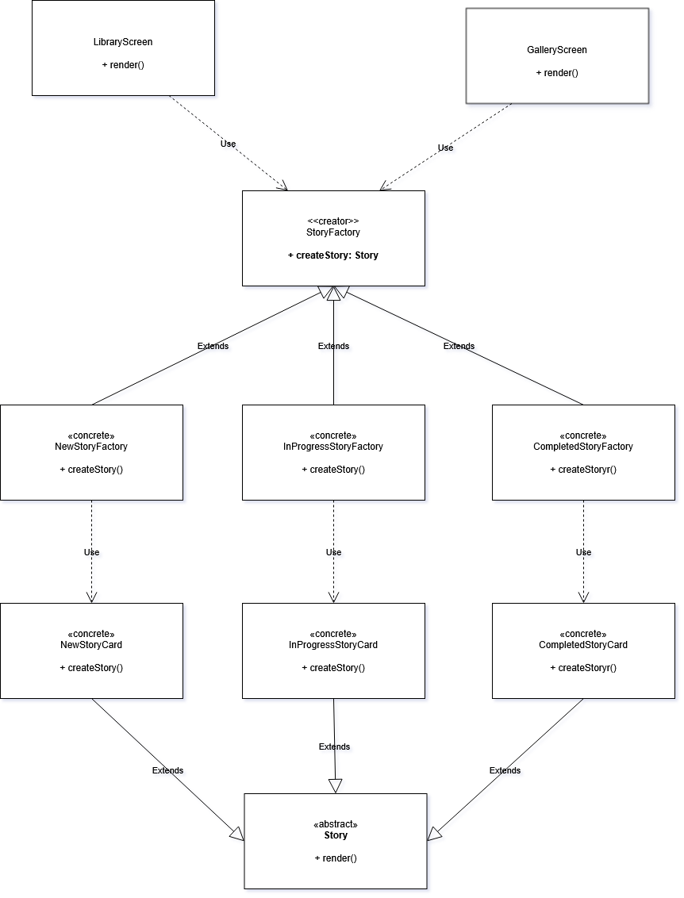

# 3.1. Módulo Padrões de Projeto GoFs Criacionais

## 3.1.1. Introdução

Padrões de projeto Criacionais tratam da criação de objetos de forma abstrata e desacoplada, promovendo flexibilidade na instanciação e permitindo que o sistema seja independente de como seus objetos são compostos e representados. O resultado prático é um sistema mais modular, adaptável e fácil de estender sem modificar código existente.<a href="#REF1">[1]</a>

Esses padrões encapsulam a lógica de criação, facilitando a manutenção e evolução do sistema. Com essa separação bem estabelecida, a introdução de novos tipos de objetos ou estratégias de criação deixa de exigir mudanças em cascata pelo código, tornando-o mais resiliente, legível e preparado para o futuro.<a href="#REF2">[2]</a>

## Participantes

Tabela 1: Participantes

| Nome | Função | Data | Horário |
| --- | --- | --- | --- |
| Ana Carolina Madeira Fialho | ### | ### | ### |
| Davi Monteiro de Negreiros | ### | ### | ### | 
| Gabriel Santos Pinto | ### | ### | ### |
| Guilherme Flyan | ### | ### | ### |
| João Marcelo Guimarães Costa Naves | GoF Criacional - Factory | 07/05 | 14:00 |
| Maria Samara | ### | ### | ### |
| Marjorie Mitzi | ### | ### | ### |
| Pedro Henrique Pereira Santos | GoF Criacional - Factory | 07/05 | 14:00 |
| Raissa Silva de Oliveira | GoF Criacional - Factory | 07/05 | 14:00 |
| Yasmin Dayrell | ### | ### | ### |

## 3.1.2. Metodologia

O estudo dos Padrões de Projeto Criacionais foi conduzido com uma abordagem prática e colaborativa, priorizando a aplicação dos conceitos em um sistema de software real, em vez de tratá-los apenas em nível teórico.

### 3.1.2.1. Revisão e Seleção de Padrões

O estudo foi iniciado com a revisão do catálogo de Padrões de Projeto Criacionais da "Gang of Four" (GoF), conforme apresentado na seção anterior. A partir desse levantamento, foram selecionados os padrões mais relevantes para resolver problemas de instanciação e criação de objetos identificados no MinhaTirinha, cujo código-fonte está hospedado em um repositório separado.

### 3.1.2.2. Aplicação e Implementação

O padrão Factory foi implementado diretamente no código-fonte do MinhaTirinha. Essa etapa foi essencial para validar a eficácia do padrão na abstração da criação de objetos, na melhoria da legibilidade do código e no aumento da flexibilidade do sistema ao longo do fluxo de geração e gerenciamento de histórias.

### 3.1.2.3. Modelagem e Documentação UML

Para documentar visualmente a estrutura e a aplicação dos padrões, os diagramas UML (Linguagem de Modelagem Unificada) foram elaborados com o Draw.io. Os diagramas produzidos, principalmente de Classe e de Sequência, mapeiam as interações e relações entre os objetos do MinhaTirinha resultantes da aplicação dos padrões Criacionais.

### 3.1.2.4. Demonstração e Colaboração

Para garantir a transparência do processo e registrar a contribuição de cada membro, as sessões de desenvolvimento, discussões técnicas e demonstrações de código foram gravadas via Microsoft Teams. Esses registros funcionam como artefatos de evidência, documentando a aplicação prática dos padrões, o fluxo colaborativo de trabalho e a participação individual da equipe na resolução dos problemas de design.

## 3.1.3. Factory

O padrão Factory é um padrão de projeto criacional que define uma interface para criar objetos, permitindo que subclasses decidam qual classe instanciar. No contexto do MinhaTirinha, sua aplicação garante que a criação de histórias seja flexível, extensível e desacoplada das classes concretas, facilitando a adição de novos tipos de stories sem impactar o código existente.

### 3.1.3.1. Diagrama UML

O padrão GoF Criacional Factory foi aplicado ao projeto, no seguinte código:

Portanto, assim ficou modelado em UML, o padrão Factory no código do aplicativo. Clique aqui para [acessar o diagrama completo]()

Fonte: [João Marcelo Guimarães Costa Naves](https://github.com/JoaoMarceloGCN), [Pedro Henrique Pereira Santos](https://github.com/pedrohpsantos), [Raissa Silva de Oliveira](https://github.com/daisha19), 2026.

#### Estrutura e Responsabilidades

- **`StoryFactory`**
Interface que define o contrato comum da hierarquia, especificando o método `createStory(): Story`. Ela garante que todas as fábricas concretas implementem um mecanismo consistente de criação, sem expor a lógica de instanciação ao cliente.

- **`Story`**
Classe abstrata que representa a entidade base comum a todos os tipos de histórias, implementando o comportamento compartilhado por meio do método `render(): ReactNode`. Todas as variações de Story Card herdam dessa classe.

- **`NewStoryFactory`, `InProgressStoryFactory` e `CompletedStoryFactory`**
Fábricas concretas que implementam `StoryFactory`, cada uma responsável pela criação de um tipo específico de história. `NewStoryFactory` instancia histórias ainda não iniciadas. `InProgressStoryFactory` cria histórias com progresso parcial registrado. `CompletedStoryFactory` produz histórias completamente pintadas, prontas para visualização ou compartilhamento.

- **`NewStoryCard`, `InProgressStoryCard` e `CompletedStoryCard`**
Implementações concretas de `Story`, produzidas pelas respectivas fábricas. Cada card renderiza o estado visual correspondente ao momento da história, diferenciando-se na apresentação e nas responsabilidades específicas do seu estado, mas compartilhando a mesma interface base.

- **`LibraryScreen` e `GalleryScreen`**
Telas que utilizam as fábricas como ponto de entrada, delegando a criação das stories de acordo com seu estado atual. O código cliente precisa apenas acionar a factory apropriada, sem conhecer os detalhes concretos de instanciação.

#### Benefícios da Aplicação

**Flexibilidade:** novos tipos de história podem ser introduzidos criando-se uma nova factory e um novo card correspondente, sem alterar o código das telas ou da lógica existente.

**Baixo acoplamento:** `LibraryScreen` e `GalleryScreen` não dependem diretamente das classes concretas de Story Card, pois a responsabilidade de instanciação está encapsulada nas fábricas.

**Extensibilidade:** o sistema permite incorporar futuros estados de história, como histórias bloqueadas ou em revisão, simplesmente adicionando novas fábricas e cards sem modificar a estrutura principal.

**Coesão:** cada classe possui uma responsabilidade única e bem delimitada, separando a lógica de criação, a renderização visual e o controle de estado de cada tipo de história.

Esse modelo demonstra a aplicação estruturada do padrão criacional Factory Method da GoF ao abstrair a instanciação de diferentes tipos de stories, permitindo que o frontend do MinhaTirinha evolua de forma modular, reutilizável e de fácil manutenção.

### 3.1.3.2. Opiniões dos Participantes

A elaboração desta etapa foi realizada de forma colaborativa em reunião pelo Microsoft Teams, onde os três membros designados estiveram presentes e participaram ativamente das discussões. O desenvolvimento do código foi conduzido no Android Studio, enquanto a criação da UML foi feita no Draw.io, ferramenta que permitiu a edição simultânea do diagrama e garantiu alinhamento entre os integrantes durante o processo.

Ao longo da atividade, cada membro contribuiu com ideias e feedbacks que ajudaram a consolidar um resultado coerente com a visão do grupo. Esse processo coletivo favoreceu tanto a consistência do diagrama quanto o fortalecimento da colaboração na equipe.

  
<strong><a href="https://github.com/daisha19">Raissa Silva de Oliveira</a></strong>

  
No início, o Factory parecia desnecessário, já que poderíamos simplesmente instanciar as classes diretamente. A sensação era de que estávamos adicionando uma camada a mais sem muita utilidade prática.Só que, conforme fui pensando na quantidade de tipos de stories que o MinhaTirinha ainda precisaria suportar, ficou claro que sem esse padrão a lógica de criação acabaria espalhada pelo sistema inteiro. Com o Factory, a adição de um novo tipo de story ficou concentrada em um único ponto, sem precisar alterar o que já estava funcionando.

  
<strong><a href="https://github.com/JoaoMarceloGCN">João Marcelo Guimarães Costa Naves</a></strong>

  
No começo, achei que usar uma factory para algo tão simples quanto criar objetos era complexidade demais para pouca necessidade. Parecia uma camada extra que só deixava o código mais distante do problema real.Mas isso mudou durante o desenvolvimento. Quando surgiu a necessidade de adicionar um novo tipo de story, percebi como a estrutura facilitava as coisas. Toda a alteração ficou concentrada na factory responsável, sem precisar mexer no restante do sistema.

  
<strong><a href="https://github.com/pedrohpsantos">Pedro Henrique Pereira Santos</a></strong>

  
No início, achei que toda aquela abstração para criar objetos fosse desnecessária e só deixasse o código mais complexo. Parecia muito esforço para algo simples.Só que, durante a implementação, ficou evidente que a ideia fazia sentido. A estrutura ajudava bastante a isolar mudanças e evitar impacto no restante do sistema. Quando surgiu a necessidade de adicionar um novo tipo de story, praticamente toda a alteração ficou concentrada na Factory, sem precisar sair modificando várias partes do projeto.

### 3.1.3.3. Vídeo Demonstrativo

Foi gravado, na plataforma do Microsoft Teams, uma reunião para a discussão e a modelagem UML do padrão Factory.

  <iframe 
    width="560" 
    height="315"
    src="https://www.youtube.com/embed/2CuM1G-3GCA"
    title="YouTube video player"
    frameborder="0"
    allow="accelerometer; autoplay; clipboard-write; encrypted-media; gyroscope; picture-in-picture"
    allowfullscreen>
  </iframe>

## 3.1.4. Referências Bibliográficas

> <a id="REF1">1.</a> GAMMA, Erich et al. **Padrões de Projeto: Soluções Reutilizáveis de Software Orientado a Objetos**. Tradução de C. F. Lucena e F. S. C. da Silva. Porto Alegre: Bookman, 2007.
>
> <a id="REF2">2.</a> REFACTORING.GURU. Factory Method. Refactoring.Guru. Disponível em: https://refactoring.guru/pt-br/design-patterns/factory-method. Acesso em: 07 mai. 2026.
>
> <a id="REF3">3.</a> BLOG GRAN CURSOS ONLINE. Padrões de Projetos GOF: Padrões Criacionais. Disponível em: https://blog.grancursosonline.com.br/padroes-de-projetos-gof-padroes-criacionais/. Acesso em: 07 mai. 2026.
>
> <a id="REF4">4.</a> MILENE. Arquitetura e Desenho de Software - Aula GoFs Criacionais. Profa. Milene. Acesso em: 07 mai. 2026.

| Versão | Data | Descrição | Autor(es) | Revisor(es) |
| :--: | :--: | :--: | :--: | :--: |
| `1.0` | 07/05/2026 | Adicionando Documentação GoF Criacional Factory | [João Marcelo Guimarães Costa Naves](https://github.com/JoaoMarceloGCN) |  |
| `1.1` | 08/05/2026 | Adicionando Documentação GoF Criacional Factory | [Raissa Silva de Oliveira](https://github.com/daisha19) |  |