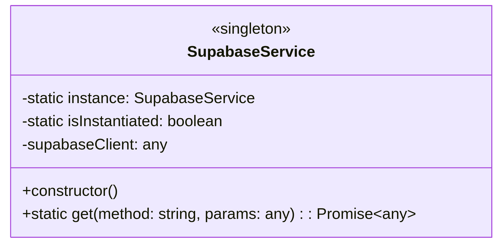
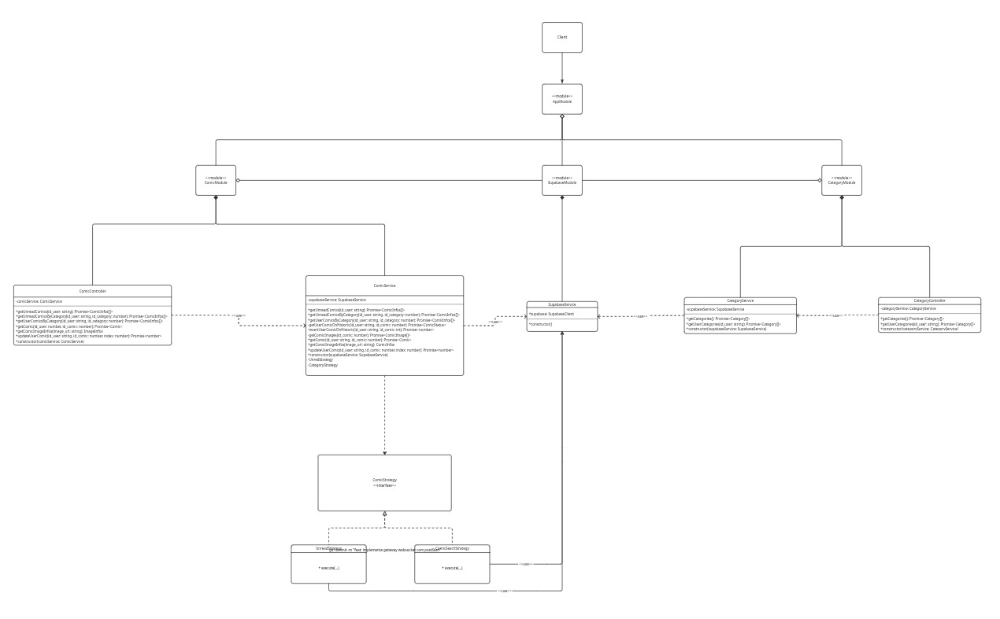
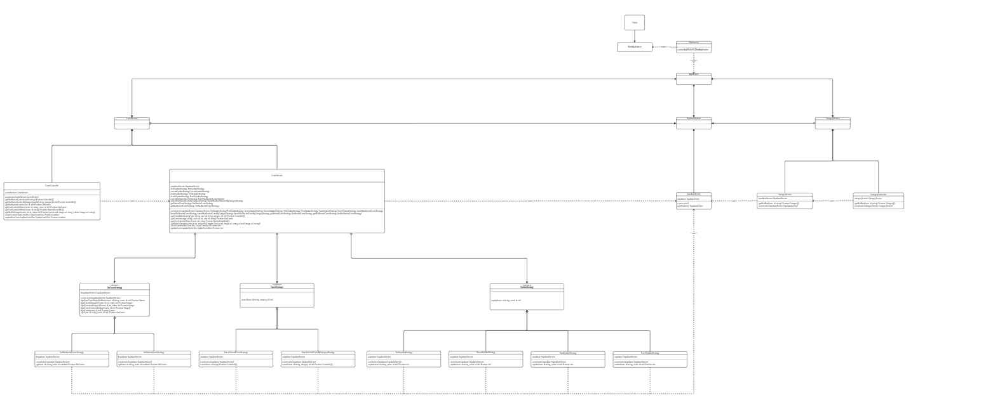
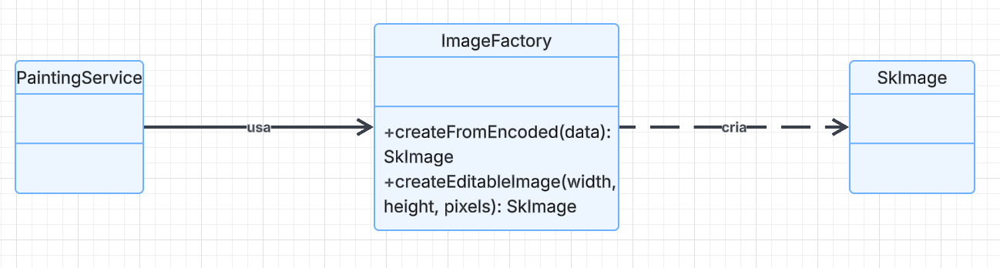

# 3.1. Módulo Padrões de Projeto GoFs Criacionais

## 3.1.1. Introdução

Padrões de projeto criacionais tratam da criação de objetos de forma controlada e desacoplada, promovendo flexibilidade na instanciação e permitindo que o sistema seja independente de como seus objetos são compostos e representados. O resultado prático é um sistema mais modular, adaptável e fácil de manter.<a href="#REF1">[1]</a>

Esses padrões encapsulam a lógica de criação, facilitando a evolução do sistema. Com essa separação, a introdução de novos objetos ou ajustes de configuração deixa de exigir mudanças espalhadas pelo código, tornando a solução mais resiliente e legível.<a href="#REF2">[2]</a>

## Participantes

<font size="3"><p style="text-align: center">Tabela 1: Participantes</p></font>

| Nome | Função | Data | Horário |
| --- | --- | --- | --- |
| Ana Carolina Madeira Fialho | ### | ### | ### |
| Davi Monteiro de Negreiros | GoF Criacional - Factory Method | 21/05 | 23:21 |
| Gabriel Santos Pinto | ### | ### | ### |
| Guilherme Flyan | ### | ### | ### |
| João Marcelo Guimarães Costa Naves | GoF Criacional - Singleton | 21/05 | 14:00 |
| Maria Samara | GoF Criacional - Singleton | 21/05 | 21:00 |
| Marjorie Mitzi | GoF Criacional - Singleton (Backend) | 22/05 | 20:00 |
| Pedro Henrique Pereira Santos | GoF Criacional - Singleton | 21/05 | 14:00 |
| Raissa Silva de Oliveira | GoF Criacional - Singleton | 21/05 | 14:00 |
| Yasmin Dayrell Albuquerque| GoF Criacional - Singleton / Factory Method | 20/05 | 15:00 |

## 3.1.2. Metodologia

O estudo dos Padrões de Projeto Criacionais foi conduzido com uma abordagem prática e colaborativa, priorizando a aplicação dos conceitos em um sistema de software real.

### 3.1.2.1. Revisão e Seleção de Padrões

O estudo foi iniciado com a revisão do catálogo de Padrões de Projeto Criacionais da "Gang of Four" (GoF), conforme apresentado na seção anterior. A partir desse levantamento, foram selecionados os padrões Singleton e Factory Method para resolver problemas distintos no projeto. O Singleton foi utilizado para centralizar a instância do Supabase no frontend e backend, enquanto o Factory Method foi aplicado na criação de imagens manipuláveis no módulo de pintura do React Native.


### 3.1.2.2. Aplicação e Implementação

Os padrões Singleton e Factory Method foram implementados diretamente no código-fonte do MinhaTirinha. O Singleton foi utilizado para centralizar instâncias compartilhadas, enquanto o Factory Method foi aplicado para encapsular a criação de objetos relacionados às imagens manipuladas pelo sistema de pintura. Essa etapa foi essencial para validar a eficácia do padrão Singleton na centralização da instância do Supabase, na melhoria da legibilidade do código e no aumento da consistência do sistema ao longo dos fluxos de autenticação, upload e atualização de dados.

### 3.1.2.3. Modelagem e Documentação UML

Para documentar visualmente a estrutura e a aplicação do padrão, o diagrama UML (Linguagem de Modelagem Unificada) foi elaborado com o Draw.io. O diagrama produzido, principalmente de classe, mapeia as interações e relações entre os elementos do frontend resultantes da aplicação do Singleton.

### 3.1.2.4. Demonstração e Colaboração

Para garantir a transparência do processo e registrar a contribuição de cada membro, as sessões de desenvolvimento, discussões técnicas e demonstrações de código foram gravadas via Microsoft Teams. Esses registros funcionam como artefatos de evidência, documentando a aplicação prática do padrão, o fluxo colaborativo de trabalho e a participação individual da equipe na resolução dos problemas de design.

## 3.1.3. Singleton

Singleton é um padrão de projeto criacional que possui os seguintes objetivos de acordo com a literatura classica: 

*__"Garantir que uma classe tenha somente uma instância e fornecer um ponto global de acesso para a mesma."__ (GAMMA, HEL, JOHNSON, VLISSIDES - Padrões de Projeto).*

A seguinte imagem, também baseada na literatura clássica, representa a implementação de uma classe singleton na notação de Diagrama de Classes UML:

 

*Fonte: GAMMA, HEL, JOHNSON, VLISSIDES - Padrões de Projeto* *Redigido por [Guilherme Flyan](https://www.github.com/GFlyan) e [João Marcelo](https://www.github.com/JoaoMarceloGCN).*

## 3.1.3.1. Aplicação do Singleton no Frontend

No frontend do MinhaTirinha localizado no nó client conforme o diagrama de implantação, essa instância única é o cliente Supabase exportado pelo módulo `source/mobile/utils/supabase.ts`.

O padrão GoF Criacional Singleton foi aplicado ao frontend do projeto, conforme o diagrama anexado pelo grupo.


<font size="2"><p style="text-align: center">Fonte: [João Marcelo Guimarães Costa Naves](https://github.com/JoaoMarceloGCN), [Pedro Henrique Pereira Santos](https://github.com/pedrohpsantos), [Raissa Silva de Oliveira](https://github.com/daisha19), 2026.</p></font>

#### Estrutura e Responsabilidades

- **`source/mobile/utils/supabase.ts`**
  - Centraliza `supabaseUrl` e `supabaseKey`.
  - Cria a instância com `createClient(...)`.
  - Exporta `supabase` como cliente único do frontend.

- **`supabase: SupabaseClient`**
  - Instância compartilhada reutilizada por importação.
  - Concentra autenticação, storage e acesso ao banco.

- **`GoogleButton`**
  - Componente de login que usa `supabase.auth.signInWithIdToken(...)`.
  - Representa o uso do Singleton no fluxo de autenticação com Google.

- **`ColorPicker` e `SaveCommand`**
  - Reutilizam a mesma instância para upload da imagem, obtenção da URL pública e atualização do registro em `Historic`.
  - Também usam a instância no fluxo de reversão da operação.

#### Benefícios da Aplicação

**Centralização da configuração:** o cliente Supabase fica em um único módulo.

**Reuso da mesma instância:** as telas e componentes importam o mesmo objeto já configurado.

**Fluxo previsível:** autenticação, storage e banco seguem o mesmo ponto de acesso.

**Menor risco de divergência:** evita múltiplas instâncias com configurações diferentes no frontend.

**Manutenção simplificada:** qualquer ajuste de configuração do Supabase é feito em um único local.

Esse modelo demonstra a aplicação estruturada do padrão criacional Singleton no frontend do MinhaTirinha, com foco exclusivo na instância compartilhada do Supabase.

### 3.1.3.1.1. Vídeo Demonstrativo

Foi gravado, na plataforma do Microsoft Teams, uma reunião para a discussão e a modelagem UML do padrão Singleton.
<div style="text-align: center;">
  <iframe 
    width="560" 
    height="315"
    src="https://youtu.be/M2iUY0JLr-Y"
    title="YouTube video player"
    frameborder="0"
    allow="accelerometer; autoplay; clipboard-write; encrypted-media; gyroscope; picture-in-picture"
    allowfullscreen>
  </iframe>
</div>

### 3.1.3.1.2. Opiniões dos Participantes

A elaboração desta etapa foi realizada de forma colaborativa em reunião pelo Microsoft Teams, onde os três membros designados estiveram presentes e participaram ativamente das discussões. O desenvolvimento do código foi conduzido no Android Studio, enquanto a criação da UML foi feita no Draw.io, ferramenta que permitiu a edição simultânea do diagrama e garantiu alinhamento entre os integrantes durante o processo.

Ao longo da atividade, cada membro contribuiu com ideias e feedbacks que ajudaram a consolidar um resultado coerente com a visão do grupo. Esse processo coletivo favoreceu tanto a consistência do diagrama quanto o fortalecimento da colaboração na equipe.

<details>
  <summary><strong><a href="https://github.com/daisha19">Raissa Silva de Oliveira</a></strong></summary>
  <p>No início, o Singleton parecia algo simples demais, porque a ideia de manter uma única instância compartilhada não chama tanta atenção no dia a dia. Só que, ao olhar para o frontend, ficou claro que essa centralização era importante para não espalhar a configuração do Supabase em vários lugares. Assim, o login, o upload de imagens e a atualização dos dados passaram a usar o mesmo cliente, o que deixou a aplicação mais consistente.</p>
</details>

<details>
  <summary><strong><a href="https://github.com/JoaoMarceloGCN">João Marcelo Guimarães Costa Naves</a></strong></summary>
  <p>De início, pensei que importar o cliente diretamente em cada componente já resolveria tudo, sem precisar falar em Singleton. Mas o desenvolvimento mostrou que centralizar a criação do Supabase em um único módulo evitou duplicidade de configuração e deixou o fluxo mais claro. O login com Google e a tela de pintura passaram a compartilhar o mesmo ponto de acesso, o que facilitou a manutenção.</p>
</details>

<details>
  <summary><strong><a href="https://github.com/pedrohpsantos">Pedro Henrique Pereira Santos</a></strong></summary>
  <p>No começo, o Singleton parecia uma solução pequena diante de todo o restante da aplicação. Depois ficou evidente que ele resolvia um problema importante: garantir que o frontend usasse sempre o mesmo SupabaseClient. Com isso, a autenticação, o storage e a atualização de dados passaram a seguir uma lógica única, sem espalhar criação de objetos pelo projeto.</p>
</details>

<details>
  <summary><strong><a href="https://github.com/YasminDayrell">Yasmin Dayrell</a></strong></summary>
  <p>Inicialmente fiquei responsável por fazer um <a href="https://drive.google.com/file/d/1trgSucPMHTBT19kSxU_ud1Z4wVNKLE9I/view">diagrama para aplicar o Factory Method</a>, porém mudamos a abordagem através de sugestões da professora e ele foi descartado. Ao ficar responsável por pesquisar como os design patterns são utilizados no React Native, me deparei com o desafio de encontrar fontes que de fato descrevessem a realidade. Porém, ao comparar blogs e publicações de desenvolvedores mais experientes, pude ter contato com a utilização do Singleton na prática. Sua utilização permite a unicidade em gerenciadores de rede, úteis de login e, como no nosso caso, conexões com o banco.</p>
</details>

<details>
  <summary><strong><a href="https://github.com/Marjoriemitzi">Marjorie Mitzi</a></strong></summary>
  <p>A implementação do Singleton no backend exigiu contornar a injeção de dependência padrão do NestJS. O objetivo principal foi expor uma instância global e estática do cliente Supabase para ser consumida diretamente pelos DTOs do padrão Strategy. Isso eliminou a necessidade de injeções repetitivas nos construtores das estratégias e centralizou o acesso ao banco de dados em um único ponto de controle.</p>
</details>

### 3.1.3.1.3. Aplicação do Singleton no Frontend

O Singleton no frontend do MinhaTirinha concentra a criação do cliente Supabase em um único arquivo e expõe essa instância para telas e componentes que precisam autenticar usuários, fazer upload de imagens ou atualizar dados no banco.

### 3.1.3.1.4. Diagrama UML

O padrão GoF Criacional Singleton foi aplicado ao frontend do projeto, conforme o diagrama anexado nesta documentação.

#### Estrutura e Responsabilidades

- **`source/mobile/utils/supabase.ts`**: arquivo central que cria a instância compartilhada com `createClient(env.SUPABASE_URL, env.SUPABASE_KEY)` e exporta `supabase`.
- **`GoogleButton`**: componente de login que usa `supabase.auth.signInWithIdToken(...)`.
- **`ColorPicker`**: tela de pintura que usa a mesma instância para persistir a imagem colorida e atualizar o quadrinho.
- **`SaveCommand`**: classe interna responsável por `storage.upload(...)`, `storage.getPublicUrl(...)`, `from('Historic').update(...)` e `storage.remove(...)`.

#### Benefícios da Aplicação

**Centralização da configuração:** o cliente Supabase fica em um único módulo.

**Reuso da mesma instância:** as telas e componentes importam o mesmo objeto já configurado.

**Fluxo previsível:** autenticação, storage e banco seguem o mesmo ponto de acesso.

**Menor risco de divergência:** evita múltiplas instâncias com configurações diferentes no frontend.

Esse modelo demonstra a aplicação do padrão Singleton no frontend do MinhaTirinha, com foco exclusivo na instância compartilhada do Supabase.

## 3.1.3.3. Aplicação do Singleton no Server

Conforme representado pela figura do diagrama de implantação **ONDE ???? --> BOTAR FOTO DO DIAGRAMA** o backend do projeto **MinhaTirinha** é implementado em **TypeScript** através de uma aplicação baseada no framework **NestJS** que é servida ao frontend por um **Web Service** hospedado no **Render**, temos ainda que o backend consome um banco de dados **PostgreSQL** implementado no **Supabase** e servido pelo mesmo.

Redigido por [Guilherme Flyan](https://www.github.com/GFlyan) e [Marjorie Mitzi](https://github.com/Marjoriemitzi).

### 3.1.3.3.1. Evolução e Rastreabilidade do Diagrama de Classes (Backend)

A modelagem do padrão Singleton no backend foi documentada em três níveis de abstração, demonstrando desde a estrutura interna da classe até a sua integração na arquitetura global do sistema.

**1. Estrutura Isolada do Singleton**
O diagrama abaixo ilustra o padrão Singleton aplicado exclusivamente ao `SupabaseService`. A classe controla sua própria instância estática, garantindo acesso unificado ao cliente do banco de dados.

<font size="2"><p style="text-align: center">Fonte: [Marjorie Mitzi](https://github.com/Marjoriemitzi), 2026.</p></font>

**2. Diagrama Intermediário (Contexto de Uso)**
Para demonstrar a rastreabilidade do padrão, o diagrama intermediário detalha como o Singleton se acopla ao módulo de quadrinhos (`ComicModule`). As classes do padrão *Strategy* consomem o ponto de acesso global fornecido pelo `SupabaseService`.

<font size="2"><p style="text-align: center">Fonte: [Marjorie Mitzi](https://github.com/Marjoriemitzi), 2026.</p></font>

**3. Integração ao Diagrama Completo do Backend**
Por fim, as implementações estruturadas acima são agregadas ao diagrama de classes completo do backend, representando a arquitetura final e unificada da API.

<font size="2"><p style="text-align: center">Fonte: [Guilherme Flyan](https://github.com/GFlyan), 2026.</p></font>

### 3.1.3.3.2. Contribuição Individual: Implementação no Backend (Marjorie Mitzi)

O framework NestJS utiliza Injeção de Dependência que, por padrão, trata os *Providers* como Singletons. Para viabilizar a arquitetura definida com o padrão *Strategy* no repositório do backend, foi implementado o controle manual da instância (padrão clássico do GoF) via propriedades estáticas. Isso evitou o acoplamento excessivo e a repetição de injeções.

**Arquivo:** `source/server/src/supabase/supabase.service.ts`
Conforme definido na [introdução](3.PadroesDeProjeto.md) nós optamos por desenvolver uma aplicação que represente o nosso backend utilizando o framework NestJS.

O NestJS fornece por padrão uma arquitetura de aplicação a ser seguida, tal arquitetura é composta por diversos conceitos centrais, sendo um desses conceitos centrais os **provedores** ou **providers**.

Segundo a documentação do NestJS:

**"A ideia principal por trás de um provedor é que ele pode ser injetado como uma dependência, permitindo que objetos estabeleçam vários relacionamentos entre si."** (*[Docs NestJS, Providers](https://docs.nestjs.com/providers)*).


e segundo a documentação do framework temos que:

"Uma única instância do provedor é compartilhada por toda a aplicação. O tempo de vida da instância está diretamente vinculado ao ciclo de vida da aplicação. Assim que a aplicação é inicializada, todos os provedores singleton são instanciados. O escopo singleton é usado por padrão."

```typescript
import { Injectable } from '@nestjs/common';

@Injectable()
export class SupabaseService {
  private static instance: SupabaseService;
  private static isInstantiated: boolean = false;
  private supabaseClient: any;

  constructor() {
    if (!SupabaseService.isInstantiated) {
      SupabaseService.instance = this;
      SupabaseService.isInstantiated = true;
    }
    return SupabaseService.instance;
  }

  static async get(method: string, params?: any) {
    const { data, error } = await SupabaseService.instance.supabaseClient.rpc(method, params);
    if (error) throw error;
    return data;
  }
}
```

* **Rastreabilidade (Commit):** [`342870e`](https://github.com/UnBArqDsw2026-1-Turma01/2026.1-T01-G08_MinhaTirinha_Entrega_03/commit/342870e) - feat: refatoracao de rpc, dtos, interfaces e singleton
* **Revisores do PR #7:** [Guilherme Flyan](https://github.com/GFlyan) 
* **Comentários da Revisão:** *(Espaço reservado para a inserção do feedback técnico deixado pelos revisores no momento do merge do Pull Request do backend).*
* **Referências Aplicadas:** * GAMMA, Erich et al. *Design Patterns: Elements of Reusable Object-Oriented Software*. Addison-Wesley Professional, 1994. (Estrutura de controle estático de instância).
  * NESTJS. *Providers - Instantiation*. Documentação Oficial. Disponível em: [https://docs.nestjs.com/providers](https://docs.nestjs.com/providers). (Ciclo de vida do container de DI do framework).


### 3.1.3.3.3. Reunião de Alinhamento e Revisão Técnica

Para garantir a transparência do processo e o alinhamento arquitetural do backend, foi realizada uma reunião técnica de revisão de código (Code Review) e modelagem UML.

**Data da Reunião:** 15 de maio de 2026 
**Participantes:** Marjorie Mitzi e Guilherme Flyan 
**Gravação:** `Reunião Grupo 1 - Alinhamento 001-20260515_190717-Gravação de Reunião.mp4` 

**Principais Pautas Discutidas:**
**Validação do Singleton no NestJS:** Discussão teórica sobre o escopo de *providers* no framework NestJS, confirmando através da documentação oficial que a injeção de dependência nativa já garante uma instância única (Singleton) para a classe `SupabaseService` durante o ciclo de vida da aplicação.
**Revisão do Padrão Strategy:** Alinhamento sobre a refatoração e separação dos algoritmos de busca (`UnreadStrategy`, `ComicSearchStrategy`) em arquivos e classes DTO isoladas, garantindo que o contexto (`ComicService`) apenas delegue a execução para a estratégia correta.
**Validação do Padrão Facade:** Confirmação de que o `ComicController` atua estritamente como uma fachada, sem conter regras de negócio, delegando a complexidade das requisições diretamente para o método `findByStrategy` da camada de serviço.
* **Refatoração dos Diagramas UML:** Definição da estratégia de documentação visual (o formato de "escadinha"). Optou-se por abstrair a complexidade criando diagramas menores e focados para cada padrão, antes de agregá-los ao diagrama estrutural geral do backend.

## 3.1.4. Factory Method
Factory Method é um padrão de projeto criacional que possui os seguintes objetivos de acordo com a literatura clássica:

"Define uma interface para criar um objeto, mas permite às subclasses decidir qual classe instanciar. O Factory Method permite a uma classe deferir a instanciação para subclasses." (GAMMA, HELM, JOHNSON, VLISSIDES - Padrões de Projeto).

Fonte: GAMMA, HELM, JOHNSON, VLISSIDES - Padrões de Projeto.

Em outras palavras, o Factory Method consiste em delegar a responsabilidade de criar objetos a métodos específicos. Assim o restante do sistema não tem necessidade de conhecer detalhes da instanciação. Centralizando a lógica de criação.
*Redigido por [Davi Negreiros](https://www.github.com/DaviNegreiros).*

### 3.1.4.1. Aplicação do Factory Method no Frontend
Embora a implementação utilize uma abordagem levemente simplificada, a solução segue os princípios do Factory Method ao encapsular a lógica de criação de objetos relacionados às imagens manipuladas pelo sistema. A classe `ImageFactory` foi criada para centralizar e encapsular a criação de objetos `SkImage`, abstraindo detalhes internos da biblioteca Skia. Dessa forma, a lógica de instanciação deixa de ficar espalhada pelo código da tela de pintura.

### 3.1.4.2. Benefícios da Aplicação
**Encapsulamento da criação:** a criação de objetos `SkImage` fica centralizada.

**Redução de acoplamento:** a tela de pintura não precisa conhecer detalhes internos da API do Skia.

**Facilidade de manutenção:** mudanças futuras na criação das imagens podem ser feitas apenas na fábrica.

**Maior legibilidade:** o código da lógica de pintura fica mais focado na regra de negócio.

### 3.1.3.1.4. Diagrama UML
Diagrama UML simplificado explicitando o funcionamento do `ImageFactory`:


### 3.1.3.1.5 Código Implementado
O código implementado dentro do script `paint.tsx` com a aplicação do Factory Method pode ser visto abaixo.
```typescript
class ImageFactory {
  static createFromEncoded(
    data: Parameters<typeof Skia.Image.MakeImageFromEncoded>[0],
  ) {
    return Skia.Image.MakeImageFromEncoded(data);
  }

  static createEditableImage(
    width: number,
    height: number,
    pixels: Uint8Array,
  ) {
    const data = Skia.Data.fromBytes(pixels);

    return Skia.Image.MakeImage({width, height, alphaType: 3, colorType: 4,}, data, width * 4,);
  }
}
```

## 3.1.5. Bibliografia Desse Tópico

> <a id="REF1">1.</a> GAMMA, Erich et al. **Padrões de Projeto: Soluções Reutilizáveis de Software Orientado a Objetos**. Tradução de C. F. Lucena e F. S. C. da Silva. Porto Alegre: Bookman, 2007.
>
> <a id="REF2">2.</a> REFACTORING.GURU. Singleton. Refactoring.Guru. Disponível em: https://refactoring.guru/pt-br/design-patterns/singleton. Acesso em: 07 mai. 2026.
>
> <a id="REF3">3.</a> BLOG GRAN CURSOS ONLINE. Padrões de Projetos GOF: Padrões Criacionais. Disponível em: https://blog.grancursosonline.com.br/padroes-de-projetos-gof-padroes-de-criacao/. Acesso em: 07 mai. 2026.
>
> <a id="REF4">4.</a> ALBUQUERQUE, Yasmin Dayrell. Pesquisa: Arquiteturas que developers usam em seus projetos RN. Brasília, 2026. Disponível em: https://docs.google.com/document/d/1tAhYBp5GVx3t5sY3uWT7G1ZN1cd74ur39t5wrExttlM/edit?usp=sharing. Acesso em: 22 mai. 2026.
>
> <a id="REF5">5.</a> NESTJS. Providers - Instantiation. Documentação Oficial. Disponível em: https://docs.nestjs.com/providers. Acesso em: 22 mai. 2026.

## 3.1.6. Bibliografia Geral

> <a id="REF6">1.</a> MILENE. Arquitetura e Desenho de Software - Aula GoFs Comportamentais. Profa. Milene. Acesso em: 07 mai. 2026.

## Histórico de Versão

| Versão | Data | Descrição | Autor(es) | Revisor(es) |
| :--: | :--: | :--: | :--: | :--: |
| `1.0` | 07/05/2026 | Adicionando Documentação GoF Criacional Singleton | [João Marcelo Guimarães Costa Naves](https://github.com/JoaoMarceloGCN) | [Yasmin Dayrell](https://github.com/YasminDayrell) |
| `1.1` | 08/05/2026 | Ajustando a Documentação GoF Criacional Singleton | [Raissa Silva de Oliveira](https://github.com/daisha19) | [Ana Carolina Madeira Fialho](https://github.com/anawcarol) |
| `1.2` | 14/05/2026 | Consolidando a Aplicação GoF Criacional Singleton no Frontend | [Pedro Henrique Pereira Santos](https://github.com/pedrohpsantos) | --- |
| `1.3` | 21/05/2026 | Atualizando as datas de participação e consolidando o histórico do Singleton no frontend | [Maria Samara](https://github.com/SamaraAlvess) | [Yasmin Dayrell](https://github.com/YasminDayrell) |
| `1.4` | 22/05/2026 | Atualizando as datas de participação | [Davi Negreiros](https://github.com/DaviNegreiros) | [Raissa Silva de Oliveira](https://github.com/daisha19) |
| `1.5` | 22/05/2026 | Adicionando pesquisa sobre GoF para Reactive Native e diagrama anterior do Factory Method | [Yasmin Dayrell](https://github.com/YasminDayrell) | [Pedro Henrique Pereira Santos](https://github.com/pedrohpsantos) |
| `1.6` | 22/05/2026 | Atualizando tabela de participação | [Maria Samara](https://github.com/SamaraAlvess) | [Ana Carolina Madeira Fialho](https://github.com/anawcarol) |
| `1.7` | 22/05/2026 | Refatoração Conceito de Singleton | [Guilherme Flyan](https://github.com/GFlyan) | --- |
| `1.8` | 22/05/2026 | Definição da Aplicação do Singleton no Backend | [Guilherme Flyan](https://github.com/GFlyan) | --- |
| `1.9` | 22/05/2026 | Documentação da Aplicação do Singleton no Backend, código e diagramas | [Marjorie Mitzi](https://github.com/Marjoriemitzi) | [Guilherme Flyan](https://github.com/GFlyan)  |
| `2.0` | 22/05/2026 | Documentação da Aplicação do Factory Method, diagramas e código | [Davi Negreiros](https://github.com/DaviNegreiros) | [Guilherme Flyan](https://github.com/GFlyan)  |