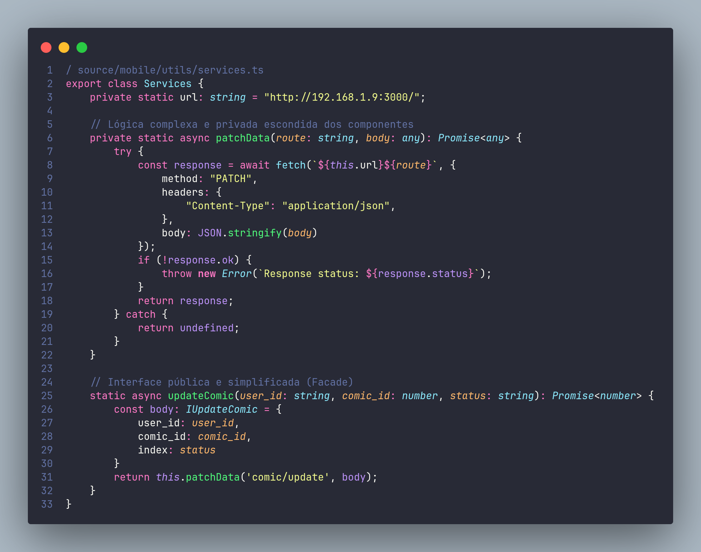
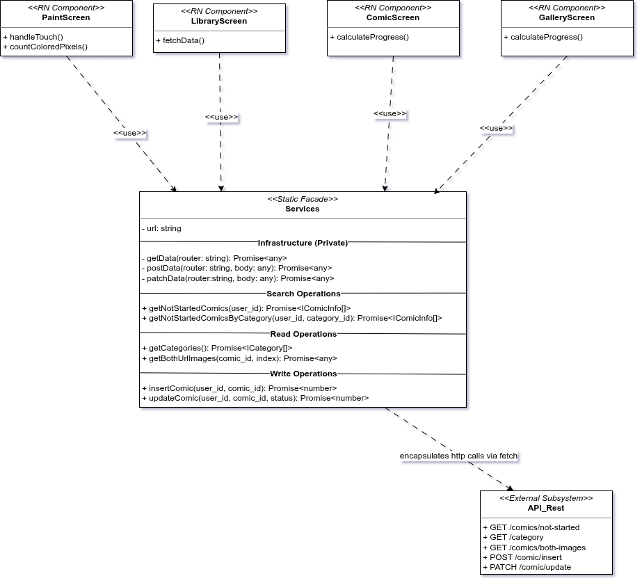
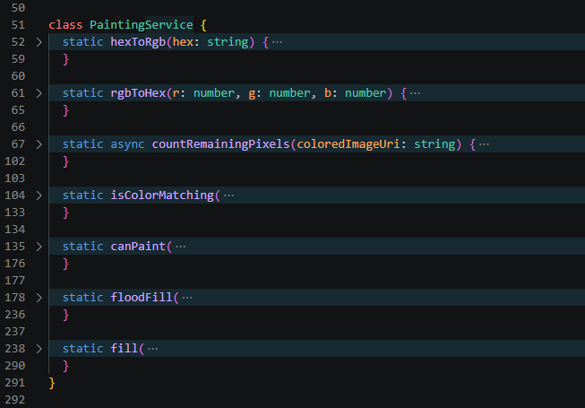
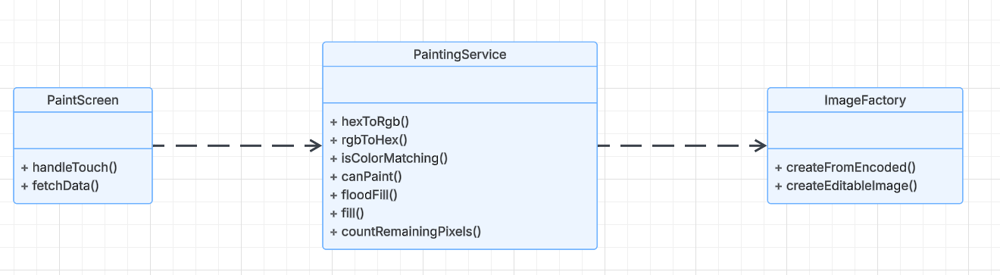
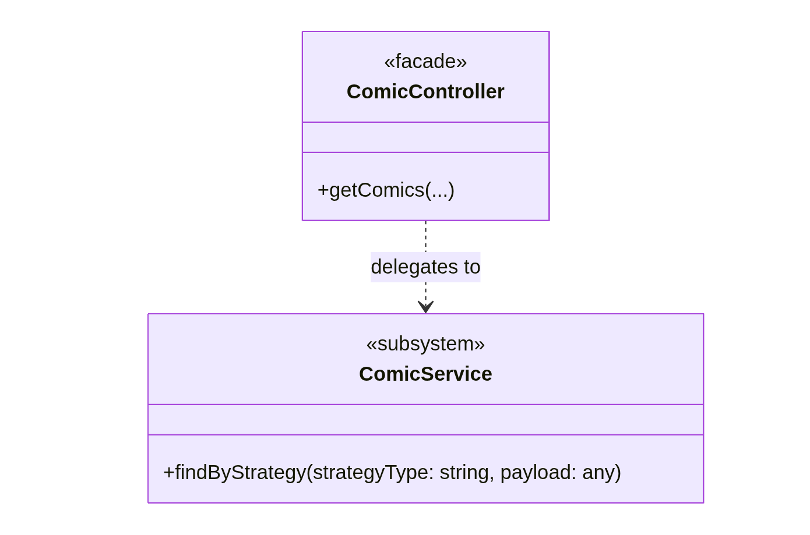

# 3.2. Módulo Padrões de Projeto GoFs Estruturais

## 3.2.1. Introdução

Padrões de projeto Estruturais tratam da composição de classes e objetos para formar estruturas mais complexas, com foco em tornar essas relações extensíveis, desacopladas e eficientes. O resultado prático é um sistema mais robusto e fácil de modificar ao longo do tempo. <a href="#REF1">[1]</a>

Esses padrões organizam as entidades do software de modo a facilitar a construção de estruturas maiores sem aumentar o acoplamento. Isso é especialmente relevante quando se trabalha com herança, pois ajuda a separar interfaces de implementações de forma clara. Com o desacoplamento bem estabelecido, mudanças em uma parte do sistema deixam de reverberar pelas demais, tornando o código mais adaptável, legível e simples de manter. <a href="#REF2">[2]</a>

## Participantes

Tabela 1: Participantes

| Nome | Função | Data | Horário |
| --- | --- | --- | --- |
| Ana Carolina Madeira Fialho | GoF Estrutural - Facade (Backend) | 21/05 | 21:00 |
| Davi Monteiro de Negreiros | GoF Estrutural - Facade | 21/05 | 23:21 | 
| Gabriel Santos Pinto | ### | ### | ### |
| Guilherme Flyan | GoF Estrutural - Facade | 22/05 | 22:50 |
| João Marcelo Guimarães Costa Naves | GoF Estrutural - Facade | 21/05 | 14:00 |
| Maria Samara | GoF Estrutural - Facade (Backend) | 21/05 | 21:00 |
| Marjorie Mitzi | GoF Estrutural - Facade (Backend) | 22/05 | 20:00 |
| Pedro Henrique Pereira Santos | GoF Estrutural - Facade | 21/05 | 14:00 |
| Raissa Silva de Oliveira | GoF Estrutural - Facade | 21/05 | 14:00 |
| Yasmin Dayrell | GoF Estrutural - Facade | 20/05 | 15:00 |

## 3.2.2. Metodologia

O estudo dos Padrões de Projeto Estruturais foi conduzido com uma abordagem prática e colaborativa, priorizando a aplicação dos conceitos em um sistema de software real, em vez de tratá-los apenas em nível teórico.

### 3.2.2.1. Revisão e Seleção de Padrões

O estudo foi iniciado com a revisão do catálogo de Padrões de Projeto Estruturais da "Gang of Four" (GoF), conforme apresentado na seção anterior. A partir desse levantamento, foram selecionados os padrões mais relevantes para resolver problemas de interação e comunicação identificados no MinhaTirinha, cujo código-fonte está hospedado em um repositório separado.

### 3.2.2.2. Aplicação e Implementação

O padrão Facade foi implementado diretamente no código-fonte do MinhaTirinha. Essa etapa foi essencial para validar a eficácia do padrão na redução do acoplamento entre os componentes de quadrinho, na melhoria da legibilidade do código e no aumento da flexibilidade da interface ao longo do fluxo de pintura.

### 3.2.2.3. Modelagem e Documentação UML

Para documentar visualmente a estrutura e a aplicação dos padrões, os diagramas UML (Linguagem de Modelagem Unificada) foram elaborados com o Draw.io. Os diagramas produzidos, principalmente de Classe e de Sequência, mapeiam as interações e relações entre os objetos do MinhaTirinha resultantes da aplicação dos padrões estruturais.

### 3.2.2.4. Demonstração e Colaboração

Para garantir a transparência do processo e registrar a contribuição de cada membro, as sessões de desenvolvimento, discussões técnicas e demonstrações de código foram gravadas via Microsoft Teams. Esses registros funcionam como artefatos de evidência, documentando a aplicação prática dos padrões, o fluxo colaborativo de trabalho e a participação individual da equipe na resolução dos problemas de design.

## 3.2.3. Facade

O padrão de projeto Facade, pertencente à categoria dos padrões estruturais da GoF, tem como objetivo fornecer uma interface unificada e simplificada para subsistemas complexos. Segundo Gamma et al. <a href="#REF1">[1]</a>, esse padrão atua como uma camada intermediária entre o cliente e os componentes internos do sistema, reduzindo dependências diretas e facilitando a utilização das funcionalidades disponíveis.

Além de reduzir o acoplamento entre os componentes da aplicação, a utilização do Facade contribuiu para melhorar a comunicação entre as camadas do sistema e facilitar futuras alterações na arquitetura, uma vez que mudanças internas nos serviços podem ser realizadas sem impactar diretamente os componentes "clientes".
*Redigido por [Maria Samara](https://www.github.com/SamaraAlvess).*

### 3.2.3.1. Aplicação do Facade no Frontend

O padrão GoF Estrutural Facade `Services` foi aplicado ao projeto, no seguinte código:

Portanto, assim ficou modelado em UML, o padrão Facade `Services` no código do aplicativo. Clique aqui para [acessar o diagrama completo]()

Fonte: [João Marcelo Guimarães Costa Naves](https://github.com/JoaoMarceloGCN), [Pedro Henrique Pereira Santos](https://github.com/pedrohpsantos), [Raissa Silva de Oliveira](https://github.com/daisha19), 2026.

Já a aplicação do Facade `PaintingService` foi aplicado no sistema a partir do código:

Portanto, assim ficou modelado em UML, o padrão Facade `PaintingService` no aplicativo:

Fonte: [Davi Monteiro de Negreiros](https://github.com/DaviNegreiros), 2026.

#### Estrutura e Responsabilidades

- **`Services`**
Fachada estática que centraliza toda a comunicação entre os componentes React Native e a API remota. Expõe uma interface simplificada dividida em grupos funcionais (Search, Read e Write Operations), ocultando completamente os detalhes de transporte HTTP dos consumidores. O atributo privado `url: string` concentra a configuração do endpoint base.

- **Infraestrutura (Privada)**
Camada interna composta pelos métodos `getData()`, `postData()` e `patchData()`, que encapsulam as chamadas HTTP via `fetch`. Esses métodos não fazem parte da interface pública da fachada e são inacessíveis diretamente pelos componentes, garantindo que nenhum consumidor precise lidar com verbos HTTP, headers ou tratamento de rede.

- **Search Operations**
Conjunto de operações somente-leitura orientadas a consultas filtradas: `getNotStartedComics(user_id)` e `getNotStartedComicsByCategory(user_id, category_id)`, ambas retornando `Promise<IComicInfo[]>`. Correspondem internamente ao endpoint `GET /comics/not-started`.

- **Read Operations**
Operações de leitura geral: `getCategories()`, que retorna `Promise<ICategory[]>`, e `getBothUrlImages(comic_id, index)`, que retorna `Promise<any>`. Mapeiam respectivamente para `GET /category` e `GET /comics/both-images`.

- **Write Operations**
Operações de escrita que modificam o estado persistido: `insertComic(user_id, comic_id)` e `updateComic(user_id, comic_id, status)`, ambas retornando `Promise<number>`. Delegam internamente para `POST /comic/insert` e `PATCH /comic/update`.

- **`PaintScreen`, `LibraryScreen`, `ComicScreen` e `GalleryScreen`**
Componentes React Native consumidores da fachada via relação `<<use>>`. Cada um acessa apenas os métodos relevantes ao seu contexto: `PaintScreen` utiliza `handleTouch()` e `countColoredPixels()`; `LibraryScreen` utiliza `fetchData()`; `ComicScreen` e `GalleryScreen` utilizam `calculateProgress()`. Nenhum deles conhece os detalhes da infraestrutura de rede.

- **`API_Rest`**
Subsistema externo que expõe os endpoints REST consumidos exclusivamente pela fachada. Os componentes da interface não possuem qualquer dependência direta sobre ele, tornando possível substituir ou versionar a API sem alterar nenhum componente de tela.

- **`PaintingService`**  
Fachada estática responsável por centralizar a lógica de manipulação das imagens no fluxo de pintura do MinhaTirinha. Expõe métodos de alto nível para análise, validação e preenchimento de regiões da imagem, ocultando os detalhes de manipulação de pixels e integração com a biblioteca gráfica.

- **Color Operations**  
Conjunto de operações auxiliares para conversão de cores. Os métodos `hexToRgb()` e `rgbToHex()` padronizam a transformação entre formatos hexadecimal e RGB utilizados durante o processo de pintura.

- **Validation Operations**  
Camada responsável pelas validações necessárias antes da pintura. Os métodos `isColorMatching()` e `canPaint()` verificam correspondência de cores, limites da imagem e permissões de preenchimento.

- **Fill Operations**  
Operações responsáveis pelo preenchimento das regiões da imagem. O método `floodFill()` executa o algoritmo de propagação entre pixels vizinhos, enquanto `fill()` coordena o fluxo completo de leitura, validação, pintura e geração da nova imagem editada.

- **Analysis Operations**  
Operações voltadas para análise do progresso da pintura. O método `countRemainingPixels()` percorre os pixels da imagem para identificar áreas ainda não preenchidas e extrair as cores disponíveis para o usuário.

- **`ImageFactory`**  
Classe auxiliar utilizada internamente pela fachada para criação de imagens manipuláveis da biblioteca Skia. Os métodos `createFromEncoded()` e `createEditableImage()` encapsulam a criação e reconstrução de objetos `SkImage`.

- **`PaintScreen`**  
Componente React Native consumidor da fachada via relação `<<use>>`. A tela utiliza apenas operações de alto nível como `fill()` e `countRemainingPixels()`, sem acessar diretamente algoritmos de preenchimento ou manipulação de pixels.

- **`Skia API`**  
Subsistema externo de renderização gráfica utilizado internamente por `PaintingService` e `ImageFactory`. Seus detalhes permanecem encapsulados pelas classes da fachada.

#### Benefícios da Aplicação

#### Benefícios da Aplicação

**Desacoplamento:** os componentes de tela dependem apenas das interfaces públicas de `Services` e `PaintingService`, sem conhecimento direto sobre verbos HTTP, URLs, manipulação de pixels, flood fill ou regras internas de processamento de imagem.

**Centralização:** qualquer alteração na comunicação remota, como troca de endpoint base, adição de headers de autenticação ou mudança de protocolo, é absorvida exclusivamente pela fachada `Services`. Da mesma forma, alterações nas regras de pintura, validação de cores ou processamento de pixels ficam concentradas em `PaintingService`, sem propagação para os componentes consumidores.

**Coesão:** a separação em grupos funcionais (Search, Read e Write) dentro de `Services` e a divisão das responsabilidades de processamento dentro de `PaintingService` refletem claramente a semântica das operações, facilitando manutenção, leitura e evolução do código.

**Encapsulamento:** operações complexas como conversão de cores, validação de pixels, leitura de imagens e execução do algoritmo `floodFill()` permanecem ocultas atrás de métodos de alto nível como `fill()` e `countRemainingPixels()`, impedindo que componentes React Native manipulem diretamente estruturas internas da biblioteca Skia.

**Testabilidade:** como a comunicação remota e o processamento de pintura estão encapsulados em fachadas estáticas, os componentes de tela podem ser testados utilizando mocks únicos de `Services` e `PaintingService`, eliminando a necessidade de interceptar chamadas HTTP ou manipular imagens reais durante os testes.

Esse modelo demonstra a aplicação do padrão estrutural Facade da GoF ao interpor camadas estáticas entre os componentes React Native e subsistemas especializados, como a API REST externa e a infraestrutura de processamento gráfico baseada em Skia, permitindo que o frontend do MinhaTirinha evolua de forma desacoplada, centralizada e com responsabilidades bem definidas.

#### 3.2.3.1.1. Vídeo Demonstrativo

Foi gravado, na plataforma do Microsoft Teams, uma reunião para a discussão e a modelagem UML do padrão Facade.

  <iframe 
    width="560" 
    height="315"
    src="https://drive.google.com/file/d/1eoaETTtTZGdWHBZ0tmC2vBqs4h_-E58k/view?usp=sharing"
    frameborder="0"
    allow="accelerometer; autoplay; clipboard-write; encrypted-media; gyroscope; picture-in-picture"
    allowfullscreen>
  </iframe>

#### 3.2.3.1.2. Opiniões dos Participantes

A elaboração desta etapa foi realizada de forma colaborativa em reunião pelo Microsoft Teams, onde os três membros designados estiveram presentes e participaram ativamente das discussões. O desenvolvimento do código foi conduzido no Android Studio, enquanto a criação da UML foi feita no Draw.io, ferramenta que permitiu a edição simultânea do diagrama e garantiu alinhamento entre os integrantes durante o processo.

Ao longo da atividade, cada membro contribuiu com ideias e feedbacks que ajudaram a consolidar um resultado coerente com a visão do grupo. Esse processo coletivo favoreceu tanto a consistência do diagrama quanto o fortalecimento da colaboração na equipe.

  
<strong><a href="https://github.com/daisha19">Raissa Silva de Oliveira</a></strong>

  
No início, o Facade me pareceu mais um nome bonito do que algo realmente útil. Só fui entender de verdade quando comecei a pensar nos quadrinhos do MinhaTirinha: cada quadrinho precisava de comportamentos diferentes dependendo do momento, como salvar o progresso enquanto pinta ou revelar o balão só depois que termina. Aí ficou claro que o padrão não estava complicando nada, estava organizando o que já era complexo.

  
<strong><a href="https://github.com/JoaoMarceloGCN">João Marcelo Guimarães Costa Naves</a></strong>

  
Confesso que demorei um pouco para sair da lógica de "por que não colocar tudo no próprio componente?". Mas quando fui implementar e vi que o componente principal continuava limpo enquanto cada componente cuidava de uma responsabilidade diferente, entendi o valor disso na prática. O código ficou muito mais fácil de mexer sem medo de quebrar outras partes.

  
<strong><a href="https://github.com/pedrohpsantos">Pedro Henrique Pereira Santos</a></strong>

  
Minha primeira reação foi ceticismo. Criar uma interface, uma classe abstrata e três componentes só para adicionar comportamentos que poderiam estar no próprio componente me pareceu trabalhoso demais. Mudei de ideia quando precisamos ajustar o gatilho do WithSpeechBubble sem mexer no resto do código. Fiz a alteração, testei, funcionou, e o resto do sistema nem percebeu. Nesse momento entendi que a estrutura não era burocracia, era proteção.

  
<strong><a href="https://github.com/YasminDayrell">Yasmin Dayrell</a></strong>

  
Após estudar diversos Design Patterns, percebi que entende-los não é algo trivial. Porém o Facade foi um método que rapidamente pude entender sua importância, pois esconder a complexidade de certas funcionalidade pode permitir um código mais limpo e entendível. Percebi sua importância também ao ficar responsável por desenvolver a lógica do algorítimo para pintura, (que foi desenvolvido em outro  <a href="https://github.com/YasminDayrell/pinturaQuadrinhoARQ-T3">repositório</a> devido a probelmas de hardware para rodar o Android Studio) em que mesmo que não tenha sido aplicado a arquitetura metodiacemnte, pois era um repositório temporário, a necessidade de encapsular funções e esconder algoritmos complexos permitiu um código muito mais legível e modular, em que eu podia facilmente indetificar onde estava o problema. Ao pesquisar a utilização dessa arquitetura na prática, muito me deparei com a aplicação dessa arquitetura em API's mais complexas, que permitem criar algo como uma "mini bilbioteca" de métodos e esconder a complexidade por trás de cada um. 

  
<strong><a href="https://github.com/Marjoriemitzi">Marjorie Mitzi</a></strong>

  
Durante a refatoração do backend, aplicamos o padrão Facade no nível do controlador (`ComicController`). O objetivo principal foi remover qualquer lógica de negócio que estivesse acoplada às rotas, delegando toda a complexidade para a camada de serviço (`ComicService`).Isso nos permitiu criar uma interface unificada e simplificada para os endpoints da API, facilitando a manutenção e garantindo que o controlador atue exclusivamente como uma fachada.

  
<strong><a href="https://github.com/DaviNegreiros">Davi Negreiros</a></strong>

  
A minha relação com esse GoF estrutural foi diferente da do resto da equipe, pois a implementação do PaintingService foi feita apenas por mim e eu não participei da criação do Services. Apesar de estar em uma porção mais específica do software, dentro da parte de pintura, ainda é incrível ver como a aplicação de um padrão transforma o código em um código mais interpretável e limpo, e isso é crucial para um código realmente bom na minha opinião.

---

### 3.2.3.2. Aplicação do Facade no Backend

Conforme já informado utilizamos o framework NestJS na aplicação do backend que é um framework que fornece uma arquitetura de aplicação a ser seguida por padrão. *Redigido por [Guilherme Flyan](https://www.github.com/GFlyan).*

Além dos providers já citados o NestJS possui outro conceito central fundamental, os controllers, sendo que:

**"Os controladores devem lidar com as requisições HTTP e delegar tarefas mais complexas aos provedores."** *([Docs NestJS - Providers](https://docs.nestjs.com/providers))*. *Redigido por [Guilherme Flyan](https://www.github.com/GFlyan).*

Ou seja, os controllers aplicam justamente o conceito do facade estabelecido pela literatura clássica:

**"Fornecer uma interface unificada para um conjunto de interfaces em um subsistema. Facade define uma interface de nível mais alto que torna o subsistema mais fácil de ser usado."** *(GAMMA, HEL, JOHNSON, VLISSIDES - Padrões de Projeto).* *Redigido por [Guilherme Flyan](https://www.github.com/GFlyan).*

Seguindo o contexto do nosso projeto e definidas as regras de negócio nos providers conseguimos definir 2 controllers para a aplicação, sendo eles:

* **ComicController**: Delega tarefas para **ComicServer**.
* **CategoryController**: Delega tarefas para **CategoryServer**.

Vale ressaltar que por mais que exista o SupabaseModule ele não possui um controller justamente pelo fato de que seu provider é utilizado apenas para instanciação única da classe mantendo assim o padrão Singleton. *Redigido por [Guilherme Flyan](https://www.github.com/GFlyan).*

#### 3.2.3.2.1. Estrutura Visual (Diagrama de Classes)

O diagrama a seguir detalha a aplicação do Facade, isolando a camada de apresentação da lógica interna do sistema.

Fonte: [Marjorie Mitzi](https://github.com/Marjoriemitzi), 2026.

Este padrão compõe a arquitetura geral do backend, interagindo diretamente com os padrões Singleton e Strategy, conforme detalhado no diagrama unificado completo.

#### 3.2.3.2.2. Contribuição Individual: Implementação (Marjorie Mitzi)

A refatoração garantiu que os endpoints expostos pelo `ComicController` não contivessem lógica condicional ou regras de negócio. A responsabilidade do controlador foi reduzida a interceptar a requisição e direcioná-la para os serviços adequados.

* **Rastreabilidade (Commit):** [`b12506e`](https://github.com/UnBArqDsw2026-1-Turma01/2026.1-T01-G08_MinhaTirinha_Entrega_03/commit/b12506e) - feat: backend estruturado em camadas e padroes implementados
* **Revisores do PR #3:** [Guilherme Flyan](https://github.com/GFlyan) 
* **Comentários da Revisão:** *(Espaço reservado para a inserção do feedback técnico deixado pelos revisores).*
* **Referências Aplicadas:** * GAMMA, Erich et al. *Design Patterns: Elements of Reusable Object-Oriented Software*. Addison-Wesley Professional, 1994. (Delegação e simplificação de interfaces).
    * NESTJS. *Controllers*. Documentação Oficial. Disponível em: [https://docs.nestjs.com/controllers](https://docs.nestjs.com/controllers).

---

## 3.2.4. Referências Bibliográficas

> <a id="REF1">1.</a> GAMMA, Erich et al. **Padrões de Projeto: Soluções Reutilizáveis de Software Orientado a Objetos**. Tradução de C. F. Lucena e F. S. C. da Silva. Porto Alegre: Bookman, 2007.
>
> <a id="REF2">2.</a> REFACTORING.GURU. Facade. Refactoring.Guru. Disponível em: https://refactoring.guru/pt-br/design-patterns/facade. Acesso em: 07 mai. 2026.
>
> <a id="REF3">3.</a> BLOG GRAN CURSOS ONLINE. Padrões de Projetos GOF: Padrões Estruturais. Disponível em: https://blog.grancursosonline.com.br/padroes-de-projetos-gof-padroes-estruturais/. Acesso em: 07 mai. 2026.
>
> <a id="REF4">4.</a> ALBUQUERQUE, Yasmin Dayrell. Pesquisa: Arquiteturas que developers usam em seus projetos RN. Brasília, 2026. Disponível em: https://docs.google.com/document/d/1tAhYBp5GVx3t5sY3uWT7G1ZN1cd74ur39t5wrExttlM/edit?usp=sharing. Acesso em: 22 mai. 2026.
>
> <a id="REF5">5.</a> Docs NestJS - Providers. Documentação Oficial. Disponível em: https://docs.nestjs.com/providers. Acesso em: 22 mai. 2026.

## 3.2.5. Bibliografia
> <a id="REF5">1.</a> MILENE. Arquitetura e Desenho de Software - Aula GoFs Comportamentais. Profa. Milene. Acesso em: 07 mai. 2026.

## Histórico de Versões 

| Versão | Data | Descrição | Autor(es) | Revisor(es) |
| :--: | :--: | :--: | :--: | :--: |
| `1.0` | 07/05/2026 | Adicionando Documentação GoF Estrutural Decorator | [Pedro Henrique Pereira Santos](https://github.com/pedrohpsantos) | [Gabriel Santos Pinto](https://github.com/GabrielSPinto) |
| `1.1` | 08/05/2026 | Adicionando video da reunião GoF Estrutural Decorator | [Raissa Silva de Oliveira](https://github.com/daisha19) | [Maria Samara](https://github.com/SamaraAlvess) |
| `1.2` | 21/05/2026 | Adicionando Documentação GoF Estrutural Facade e removendo Decorator | [Pedro Henrique Pereira Santos](https://github.com/pedrohpsantos) | [João Marcelo Guimarães Costa Naves](https://github.com/JoaoMarceloGCN) |
| `1.3` | 22/05/2026 | Atualizando as datas de participação | [Davi Negreiros](https://github.com/DaviNegreiros) | [Raissa Silva de Oliveira](https://github.com/daisha19) |
| `1.4` | 22/05/2026 | Adicinando repositório do algorítimo de pintura e pesquisa sobre GoF para Reactive Nativ | [Yasmin Dayrell](https://github.com/YasminDayrell) | [Pedro Henrique Pereira Santos](https://github.com/pedrohpsantos) |
| `1.5` | 22/05/2026 | Atualizando tabela de participação | [Maria Samara](https://github.com/SamaraAlvess) |  [Ana Carolina Madeira Fialho](https://github.com/anawcarol) |
| `1.6` | 22/05/2026 | Adicionando Documentação GoF Estrutural Facade no Backend | [Marjorie Mitzi](https://github.com/Marjoriemitzi) | [Guilherme Flyan](https://github.com/GFlyan)   |
| `1.7` | 22/05/2026 | Introdução Aplicação Facade no Backend | [Marjorie Mitzi](https://github.com/Marjoriemitzi) | [Guilherme Flyan](https://github.com/GFlyan)   |
| `1.8` | 22/05/2026 | Adicionando Documentação GoF Estrutural Facade PaintingService e complementando documentação geral do Facade | [Davi Negreiros](https://github.com/DaviNegreiros) | [João Marcelo Guimarães Costa Naves](https://github.com/JoaoMarceloGCN)   |
