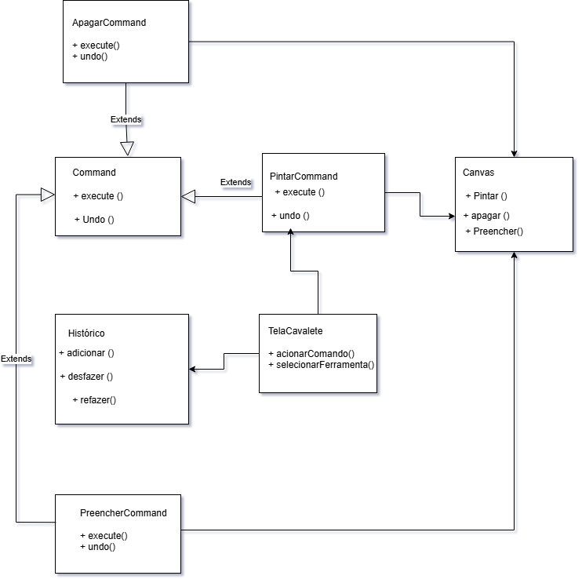
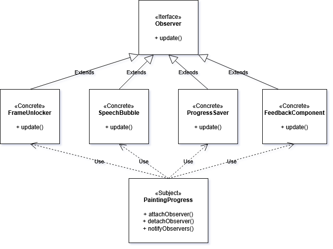

# 3.3. Módulo Padrões de Projeto GoFs Comportamentais


## 3.3.1 Introdução

Os Padrões de Projeto Comportamentais integram o catálogo de soluções apresentado pela “Gang of Four” (GoF) <a href="#REF1">[1]</a> para resolver problemas frequentes no desenvolvimento de sistemas orientados a objetos. Diferentemente dos padrões Criacionais, voltados para a criação de objetos, e dos Estruturais, responsáveis pela organização entre classes e interfaces, os padrões Comportamentais têm como foco a interação e a comunicação entre os objetos do sistema, buscando tornar essa colaboração mais flexível e desacoplada.

Esses padrões desempenham um papel importante na definição de fluxos de controle mais dinâmicos, permitindo encapsular algoritmos e modificar comportamentos sem causar impactos no restante da aplicação. Além disso, contribuem para uma melhor distribuição de responsabilidades, favorecendo a manutenção, reutilização e expansão do código <a href="#REF2">[2]</a>. No desenvolvimento de jogos eletrônicos, por exemplo, sua utilização possibilita a modularização de comportamentos complexos e variáveis, como destacado por Figueiredo em sua dissertação <a href="#REF3">[3]</a>, tornando os sistemas mais adaptáveis às constantes mudanças e necessidades de interação.

## Participantes

 <font size="3"><p style="text-align: center">Tabela 1: Participantes</p></font>

| Participantes | Função | Data | Hora
|-------|--------|--------|--------|
| Ana Carolina Madeira Fialho   |  ###    |  ###  | ###  |
| Davi Monteiro de Negreiros  | ###   | ###  | ###  | ###  |
| Gabriel Santos Pinto | #### | ### | #### |
| Guilherme Flyan | ### | ### | ### |
| João Marcelo Guimarães Costa Naves | GoF Comportamental - Command / Observer | 07/05 | 14:00 |
| Maria Samara | ### | ### | ### |
| Marjorie Mitzi | ### | ### | ### |
| Pedro Henrique Pereira Santos | GoF Comportamental - Command / Observer | 07/05 | 14:00 |
| Raissa Silva de Oliveira | GoF Comportamental - Command / Observer | 07/05 | 14:00 |
| Yasmin Dayrell | ### | ### | ### |


## 3.3.2 Metodologia

O estudo e a análise dos Padrões de Projeto Comportamentais foram realizados por meio de uma abordagem colaborativa e prática, com foco na utilização dos conceitos em um sistema de software já existente.

### 3.3.2.1. Revisão e Seleção de Padrões

O desenvolvimento do estudo teve início com a análise do catálogo de Padrões de Projeto Comportamentais da “Gang of Four” (GoF), apresentado anteriormente. A partir dessa revisão, foram identificados e selecionados os padrões mais adequados às necessidades do projeto MinhaTirinha, especialmente aqueles relacionados à interação do usuário, ao gerenciamento de estados da aplicação e à comunicação entre os componentes da interface. A escolha dos padrões considerou situações presentes no sistema, como o fluxo de desbloqueio dos balões de fala, o gerenciamento das ferramentas de pintura do Cavalete e o salvamento do progresso das tirinhas no ambiente da aplicação mobile.

### 3.3.2.2. Modelagem e Documentação UML

Para documentar visualmente a estrutura e a aplicação dos padrões, os diagramas UML (Linguagem de Modelagem Unificada) foram elaborados com o Draw.io. Os diagramas produzidos, principalmente de Classe e de Sequência, mapeiam as interações e relações entre os objetos do MinhaTirinha resultantes da aplicação dos padrões Comportamentais.

### 3.3.2.3. Demonstração e Colaboração

Para assegurar a organização do desenvolvimento e registrar a participação dos integrantes da equipe, as reuniões de planejamento, discussões sobre decisões arquiteturais e apresentações das funcionalidades implementadas foram documentadas ao longo do projeto. Esses registros serviram como evidências do processo colaborativo adotado no desenvolvimento do MinhaTirinha, demonstrando a aplicação prática dos padrões comportamentais, a integração entre os membros do grupo e a contribuição individual na construção das soluções relacionadas à interação e ao fluxo da aplicação.

## 3.3.3. Command

O padrão Command é um dos padrões comportamentais definidos pela Gang of Four (GoF) e tem como principal objetivo encapsular uma solicitação ou ação em um objeto separado. Dessa forma, comandos podem ser executados, armazenados, organizados e até desfeitos posteriormente, sem que a interface principal precise conhecer os detalhes de implementação de cada ação. Esse padrão promove um maior desacoplamento entre quem solicita uma operação e quem realmente a executa.

No contexto do projeto MinhaTirinha, o padrão Command se mostra adequado para o desenvolvimento do frontend da aplicação, especialmente nas interações realizadas pelo usuário dentro da interface do Cavalete. Ações como pintar uma área, apagar uma região, selecionar cores ou redefinir a pintura podem ser tratadas como comandos independentes, facilitando a organização do fluxo de interação da aplicação. Além disso, essa abordagem possibilita futuras funcionalidades como desfazer e refazer ações de pintura, tornando o sistema mais flexível, modular e de fácil manutenção.

### 3.3.3.1 Diagrama UML

Dessa forma, o padrão Command foi representado na modelagem UML do frontend da aplicação MinhaTirinha.


<font size="2"><p style="text-align: center">Fonte: [Raissa Silva de Oliveira](https://github.com/daisha19), [Pedro Henrique Pereira Santos]("https://github.com/pedrohpsantos"), [João Marcelo Guimarães Costa Naves](https://github.com/JoaoMarceloGCN) , 2025.</p></font>

#### Estrutura e Responsabilidades

- **`Command`**  
Classe abstrata responsável por definir o contrato dos comandos da aplicação, especificando os métodos `execute()` e `undo()`. Ela estabelece uma interface comum para todas as ações executadas no Cavalete.

- **`PintarCommand`, ApagarCommand e PreencherCommand**
Implementações concretas do padrão Command.
Cada classe representa uma ação específica realizada pelo usuário no sistema de pintura, encapsulando a lógica necessária para executar e desfazer operações no Canvas.

- **`Canvas`**  
Responsável pelas operações gráficas da área de pintura.
Essa classe executa ações como pintar, apagar e preencher regiões do quadrinho, sendo utilizada pelos comandos concretos para aplicar as alterações visuais na interface.

- **`TelaCavalete`**  
Atua como o invocador do padrão.
Ela é responsável por receber as interações do usuário, selecionar ferramentas e acionar os comandos correspondentes durante o uso do sistema de pintura.

- **`Historico`**  
Classe encarregada de armazenar os comandos executados.
Ela gerencia funcionalidades como desfazer e refazer ações, permitindo controlar o histórico de alterações realizadas pelo usuário no Canvas.

#### Benefícios da Aplicação

**Flexibilidade:** novas ações e ferramentas do Cavalete podem ser adicionadas facilmente por meio da criação de novos comandos que implementem a estrutura da classe `Command`.

**Baixo acoplamento:** a interface do frontend não depende diretamente da implementação de cada ação de pintura, já que os comportamentos são encapsulados em comandos independentes.

**Extensibilidade:** o sistema permite adicionar funcionalidades futuras, como novas ferramentas, atalhos de interação ou diferentes tipos de edição, sem modificar a estrutura principal da interface.

**Coesão:** cada classe possui uma responsabilidade específica e bem definida, separando o gerenciamento da interface, o histórico de ações, os comandos e as operações gráficas do Canvas.

Esse modelo demonstra a aplicação estruturada do padrão comportamental Command da GoF, ao encapsular ações do usuário em objetos independentes, permitindo que o sistema organize operações de forma modular, reutilizável e de fácil manutenção no frontend do MinhaTirinha.

#### 3.3.3.2. Opiniões dos Participantes

A elaboração desta etapa foi realizada de forma colaborativa por meio de reuniões realizadas no Teams, contando com a participação ativa dos integrantes responsáveis pelo desenvolvimento do padrão comportamental Command no frontend do projeto MinhaTirinha. Durante os encontros, foram discutidas as decisões relacionadas à modelagem das ações do Cavalete e à organização das responsabilidades entre os componentes da interface.

A modelagem UML foi produzida utilizando o Draw.io, ferramenta que permitiu a edição simultânea do diagrama e facilitou a integração das ideias propostas pelos membros da equipe.

Ao longo da atividade, os integrantes contribuíram com sugestões e revisões que auxiliaram na construção de uma solução mais organizada e coerente com a arquitetura do projeto. Esse processo colaborativo favoreceu tanto a consistência da modelagem quanto o alinhamento técnico entre os participantes.

<details>
  <summary><strong><a href="https://github.com/daisha19">Raissa Silva de Oliveira</a></strong></summary>
  <p>Na minha percepção, o desenvolvimento desta etapa do projeto contribuiu para uma melhor compreensão sobre a aplicação prática dos padrões comportamentais no frontend de um sistema interativo. A modelagem do padrão Command no contexto do MinhaTirinha ajudou a organizar as ações do usuário dentro do Cavalete de forma mais modular e desacoplada, facilitando a separação das responsabilidades entre interface, comandos e operações do Canvas.

  Além disso, a construção do diagrama UML permitiu visualizar com maior clareza a comunicação entre os componentes do frontend, tornando a arquitetura mais compreensível e preparada para futuras expansões, como a implementação de novas ferramentas e funcionalidades de desfazer e refazer ações.
</p>
</details>
<details>
  <summary><strong><a href="https://github.com/pedrohpsantos">Pedro Henrique Pereira Santos</a></strong></summary>
  <p>Durante o desenvolvimento dessa etapa, foi possível perceber a importância de uma boa organização arquitetural no frontend da aplicação. A utilização do padrão Command trouxe uma estrutura mais clara para o gerenciamento das interações do usuário, principalmente nas funcionalidades relacionadas ao sistema de pintura do Cavalete.

  A elaboração do diagrama UML também ajudou a entender melhor como os componentes do frontend se relacionam entre si, facilitando a visualização das responsabilidades de cada classe. Além de contribuir para a documentação do projeto, essa modelagem tornou o desenvolvimento mais organizado e auxiliou na identificação de possíveis melhorias e expansões futuras para a aplicação.
</p>
</details>
<details>
  <summary><strong><a href="https://github.com/JoaoMarceloGCN">João Marcelo Guimarães Costa Naves</a></strong></summary>
  <p>Na minha opinião, a aplicação do padrão Command no frontend do MinhaTirinha foi uma experiência importante para compreender como padrões comportamentais podem melhorar a estrutura de aplicações interativas. A separação das ações em comandos independentes tornou a lógica das ferramentas do Cavalete mais organizada e fácil de manter.

  Além disso, o desenvolvimento do diagrama UML contribuiu para uma visão mais clara da arquitetura do frontend, auxiliando no entendimento do fluxo das interações do usuário dentro da aplicação. O trabalho em equipe também foi essencial para discutir soluções e alinhar as ideias durante a modelagem do sistema.
</p>
</details>

### 3.3.3.3. Vídeo Demonstrativo

Foi gravado, na plataforma do Microsoft Teams, uma reunião para a discussão e a modelagem UML do padrão Command.
<div style="text-align: center;">
  <iframe 
    width="560" 
    height="315"
    src="https://www.youtube.com/embed/MOqutEYCvEs"
    title="YouTube video player"
    frameborder="0"
    allow="accelerometer; autoplay; clipboard-write; encrypted-media; gyroscope; picture-in-picture"
    allowfullscreen>
  </iframe>
</div>


## 3.3.4 Observer

O padrão Observer é um padrão comportamental que define uma dependência de um-para-muitos entre objetos, de forma que quando o estado de um objeto (o sujeito) muda, todos os seus dependentes (os observadores) são notificados e atualizados automaticamente. Esse padrão promove baixo acoplamento entre o objeto que gera eventos e os objetos que reagem a esses eventos, facilitando a extensibilidade e a reutilização do código.

### Estrutura e participantes

- **`Subject` (ou `PaintingProgress`)**: mantém uma lista de observadores e provê métodos para `attach(observer)`, `detach(observer)` e `notifyObservers()` quando seu estado muda.
- **`Observer`**: interface que declara o método `update()` a ser implementado por todos os observadores concretos.
- **Observadores concretos (ex.: `FrameUnlocker`, `SpeechBubble`, `ProgressSaver`, `FeedbackComponent`)**: implementam `update()` para reagir às mudanças do `Subject`.

### Diagrama UML


<font size="2"><p style="text-align: center">Fonte: [João Marcelo Guimarães Costa Naves](https://github.com/JoaoMarceloGCN), [Pedro Henrique Pereira Santos](https://github.com/pedrohpsantos) e [Raissa Silva de Oliveira](https://github.com/daisha19), Diagrama de arquitetura do time MinhaTirinha (2026).</p></font>

### Aplicação no MinhaTirinha

No contexto do MinhaTirinha, o padrão Observer foi utilizado para representar o fluxo de progresso da pintura e notificar componentes da interface sobre mudanças de estado. Por exemplo:

- O `PaintingProgress` atua como `Subject`, atualizando o progresso de pintura conforme o usuário desenha.
- Componentes como `FrameUnlocker` (desbloqueio do quadro), `SpeechBubble` (balões de fala que aparecem quando algo é concluído), `ProgressSaver` (persistência do progresso) e `FeedbackComponent` (indicadores visuais) se registram como `Observers` e reagem às atualizações chamando seus próprios `update()`.

Essa abordagem permite desacoplar a lógica de progresso do código que atualiza a interface, tornando simples adicionar novos ouvintes (observadores) sem modificar o `Subject`.

### Vantagens observadas

- **Desacoplamento:** o `Subject` não precisa conhecer detalhes dos observadores.
- **Extensibilidade:** novos comportamentos reativos podem ser adicionados registrando novos observadores.
- **Clareza na propagação de eventos:** o modelo facilita o raciocínio sobre quem precisa ser notificado quando o estado muda.

### Exemplo simplificado (pseudocódigo)

```
class PaintingProgress implements Subject {
  observers = []
  progresso = 0

  attach(o) { observers.push(o) }
  detach(o) { observers.remove(o) }
  notify() { observers.forEach(o => o.update(this)) }

  setProgresso(p) { this.progresso = p; this.notify() }
}

interface Observer { update(subject) }

class ProgressSaver implements Observer {
  update(subject) { salvarProgressoRemoto(subject.progresso) }
}
```

Essa implementação pode ser adaptada à arquitetura React/Context usada no frontend do projeto, por exemplo expondo o `PaintingProgress` via Context ou hooks e conectando componentes para reagir às mudanças.

### 3.3.4.1. Opiniões dos Participantes

<details>
  <summary><strong><a href="https://github.com/daisha19">Raissa Silva de Oliveira</a></strong></summary>
  <p>Na minha visão, a aplicação do Observer tornou a comunicação entre o progresso da pintura e os componentes da interface muito mais limpa. Foi simples adicionar o salvamento automático e os indicadores de feedback sem alterar a lógica central do `PaintingProgress`. O diagrama ajudou a esclarecer onde cada observador deve se ligar.</p>
</details>
<details>
  <summary><strong><a href="https://github.com/pedrohpsantos">Pedro Henrique Pereira Santos</a></strong></summary>
  <p>Percebi que o desacoplamento proporcionado pelo padrão facilita testes unitários e reduz riscos ao estender funcionalidades. Podemos adicionar novos ouvintes (por exemplo, analytics) sem tocar no sujeito, o que é ótimo para manutenção.</p>
</details>
<details>
  <summary><strong><a href="https://github.com/JoaoMarceloGCN">João Marcelo Guimarães Costa Naves</a></strong></summary>
  <p>Concordo que a integração com o fluxo React (Context / hooks) será direta. O diagrama serviu como guia prático para a implementação e deixou claro como mapear os componentes atuais para observadores.</p>
</details>

## 3.3.5. Referências Bibliográficas

> <a id="REF1">1.</a> GAMMA, Erich et al. **Padrões de Projeto: Soluções Reutilizáveis de Software Orientado a Objetos**. Tradução de C. F. Lucena e F. S. C. da Silva. Porto Alegre: Bookman, 2007.
>
> <a id="REF2">2.</a> REFACTORING.GURU. Command. Refactoring.Guru. Disponível em: https://refactoring.guru/pt-br/design-patterns/command. Acesso em: 07 mai. 2026.
>
> <a id="REF3">3.</a> BLOG GRAN CURSOS ONLINE. Padrões de Projetos GOF: Padrões Comportamentais. Disponível em: https://blog.grancursosonline.com.br/padroes-de-projetos-gof-padroes-comportamentais/. Acesso em: 07 mai. 2026.
>
> <a id="REF4">4.</a> MILENE. Arquitetura e Desenho de Software - Aula GoFs Comportamentais. Profa. Milene. Acesso em: 07 mai. 2026.


## Histórico de Versões 📅

| Versão | Data | Descrição | Autor(es) | Revisor(es) |
| :--: | :--: | :--: | :--: | :--: |
| `1.0` | 07/05/2026 | Adicionando Documentação GoF Comportamental Command | [Raissa Silva de Oliveira](https://github.com/daisha19) |  |
| `1.1` | 08/05/2026 | Adicionando video da reunião GoF Comportamental Command | [Raissa Silva de Oliveira](https://github.com/daisha19) |  |
| `1.2` | 08/05/2026 16:30 | Adicionando documentação do padrão Observer e diagrama | [João Marcelo Guimarães Costa Naves](https://github.com/JoaoMarceloGCN), [Pedro Henrique Pereira Santos](https://github.com/pedrohpsantos), [Raissa Silva de Oliveira](https://github.com/daisha19) | Davi Monteiro de Negreiros |