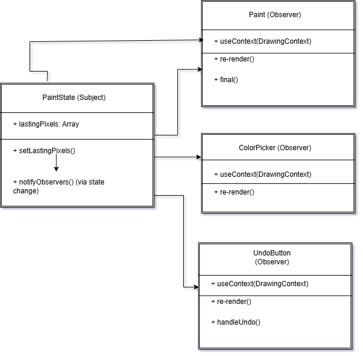
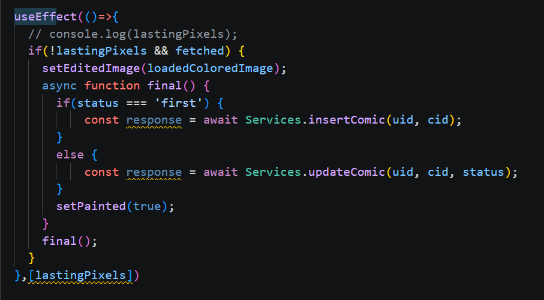

# 3.3. Módulo Padrões de Projeto GoFs Comportamentais

## 3.3.1 Introdução

Os Padrões de Projeto Comportamentais integram o catálogo de soluções apresentado pela “Gang of Four” (GoF) <a href="#REF1">[1]</a> para resolver problemas frequentes no desenvolvimento de sistemas orientados a objetos. Diferentemente dos padrões Criacionais, voltados para a criação de objetos, e dos Estruturais, responsáveis pela organização entre classes e interfaces, os padrões Comportamentais têm como foco a interação e a comunicação entre os objetos do sistema, buscando tornar essa colaboração mais flexível e desacoplada.

Esses padrões desempenham um papel importante na definição de fluxos de controle mais dinâmicos, permitindo encapsular algoritmos e modificar comportamentos sem causar impactos no restante da aplicação. Além disso, contribuem para uma melhor distribuição de responsabilidades, favorecendo a manutenção, reutilização e expansão do código <a href="#REF2">[2]</a>. No desenvolvimento de jogos eletrônicos, por exemplo, sua utilização possibilita a modularização de comportamentos complexos e variáveis, como destacado por Figueiredo em sua dissertação <a href="#REF3">[3]</a>, tornando os sistemas mais adaptáveis às constantes mudanças e necessidades de interação.

## Participantes

 
Tabela 1: Participantes

| Participantes | Função | Data | Hora
|-------|--------|--------|--------|
| Ana Carolina Madeira Fialho   |  ###    |  ###  | ###  |
| Davi Monteiro de Negreiros  | ###   | ###  | ###  | ###  |
| Gabriel Santos Pinto | #### | ### | #### |
| Guilherme Flyan | ### | ### | ### |
| João Marcelo Guimarães Costa Naves | GoF Comportamental - Observer | 21/05 | 14:00 |
| Maria Samara | ### | ### | ### |
| Marjorie Mitzi | ### | ### | ### |
| Pedro Henrique Pereira Santos | GoF Comportamental - Observer | 21/05 | 14:00 |
| Raissa Silva de Oliveira | GoF Comportamental - Observer | 21/05 | 14:00 |
| Yasmin Dayrell | ### | ### | ### |

## 3.3.2 Metodologia

O estudo e a análise dos Padrões de Projeto Comportamentais foram realizados por meio de uma abordagem colaborativa e prática, com foco na utilização dos conceitos em um sistema de software já existente.

### 3.3.2.1. Revisão e Seleção de Padrões

O desenvolvimento do estudo teve início com a análise do catálogo de Padrões de Projeto Comportamentais da “Gang of Four” (GoF), apresentado anteriormente. A partir dessa revisão, foram identificados e selecionados os padrões mais adequados às necessidades do projeto MinhaTirinha, especialmente aqueles relacionados à interação do usuário, ao gerenciamento de estados da aplicação e à comunicação entre os componentes da interface. A escolha dos padrões considerou situações presentes no sistema, como o fluxo de desbloqueio dos balões de fala, o gerenciamento das ferramentas de pintura do Cavalete e o salvamento do progresso das tirinhas no ambiente da aplicação mobile.

### 3.3.2.2. Modelagem e Documentação UML

Para documentar visualmente a estrutura e a aplicação dos padrões, os diagramas UML (Linguagem de Modelagem Unificada) foram elaborados com o Draw.io. Os diagramas produzidos, principalmente de Classe e de Sequência, mapeiam as interações e relações entre os objetos do MinhaTirinha resultantes da aplicação dos padrões Comportamentais.

### 3.3.2.3. Demonstração e Colaboração

Para assegurar a organização do desenvolvimento e registrar a participação dos integrantes da equipe, as reuniões de planejamento, discussões sobre decisões arquiteturais e apresentações das funcionalidades implementadas foram documentadas ao longo do projeto. Esses registros serviram como evidências do processo colaborativo adotado no desenvolvimento do MinhaTirinha, demonstrando a aplicação prática dos padrões comportamentais, a integração entre os membros do grupo e a contribuição individual na construção das soluções relacionadas à interação e ao fluxo da aplicação.

## 3.3.3 Observer

O padrão Observer é um padrão comportamental que define uma dependência de um-para-muitos entre objetos, de forma que quando o estado de um objeto (o sujeito) muda, todos os seus dependentes (os observadores) são notificados e atualizados automaticamente. Esse padrão promove baixo acoplamento entre o objeto que gera eventos e os objetos que reagem a esses eventos, facilitando a extensibilidade e a reutilização do código.

### Estrutura e participantes

* **`Subject` (ou `PaintState`)**: É a estrutura que centraliza e gerencia o estado da aplicação. No código do projeto, ele armazena dados cruciais como `lastingPixels` (matriz de pixels pintados), `comicStatus` e o percentual de `progress`. Em vez de métodos imperativos como `attach` ou `detach`, a inscrição dos observadores ocorre de forma declarativa pelo fluxo reativo do React. O método `notifyObservers()` é disparado implicitamente através das funções de atualização de estado (como `setLastingPixels`), que forçam a propagação dos novos dados.
* **`IObserver` (Interface de Observação)**: No ambiente reativo do React, essa interface é representada pelo contrato de consumo de estados e hooks (`useContext` ou escuta de dependências via `useEffect`). Ela define que qualquer entidade inscrita deve ser capaz de monitorar as mutações do estado e engatilhar um ciclo de atualização.
* **Observadores Concretos (ex.: `Paint`, `ColorPicker`, `UndoButton`)**: São as estruturas e componentes funcionais da interface do usuário. 
* O componente principal **`Paint`** atua como observador via `useEffect`, disparando as rotinas de persistência `final()` e a lógica de cálculo de progresso `calculateProgress()` sempre que o estado é alterado.
* Os componentes **`ColorPicker`** e **`UndoButton`** atuam consumindo o contexto e reagindo por meio de um **`re-render()`** automático para redesenhar a paleta de cores ou gerenciar o histórico de ações assim que o `Subject` altera o estado.

### Diagrama UML

Fonte: [João Marcelo Guimarães Costa Naves](https://github.com/JoaoMarceloGCN), [Pedro Henrique Pereira Santos](https://github.com/pedrohpsantos) e [Raissa Silva de Oliveira](https://github.com/daisha19), Diagrama de arquitetura do time MinhaTirinha (2026).

### Aplicação no MinhaTirinha

No contexto do *MinhaTirinha*, o padrão **Observer** foi utilizado para estruturar o fluxo reativo do módulo de pintura (Cavalete) no front-end, notificando os componentes da interface e os serviços de persistência em tempo real sobre as mudanças de estado da tela. A dinâmica ocorre da seguinte forma:

* O **`PaintState`** atua como o **`Subject`**, gerenciando e centralizando o estado de modificação dos pixels (`lastingPixels`), o estado de conclusão dos quadrinhos (`comicStatus`) e o percentual de progresso.
* O componente principal **`Paint`** se registra implicitamente como um **`Observer`** através do hook `useEffect`. Assim que o usuário interage com a tela e altera os pixels, esse observador é notificado pelo React e dispara a rotina de salvamento automático via função `final()` (que faz a chamada para `Services.updateComic`) e atualiza o progresso com o método `calculateProgress()`.
* Componentes adjacentes, como **`ColorPicker`** (atualização do indicador da cor ativa) e **`UndoButton`** (controle de histórico de ações), também atuam como **`Observers`** ao consumirem o mesmo contexto de desenho. Eles reagem de forma assíncrona a qualquer alteração de estado disparando seus respectivos ciclos de **`re-render()`**.

Essa abordagem permite desacoplar totalmente a lógica de gerenciamento de dados de pintura do código que atualiza a interface gráfica ou que conversa com a API do backend, tornando extremamente simples adicionar novos ouvintes (como métricas de uso ou animações de conquista) sem modificar a estrutura central do `Subject`.

### Mapeamento do Padrão no Código Real

O diagrama acima ilustra a estrutura geral de observação do ecossistema do Cavalete. Na prática, essa mesma mecânica reativa do padrão **Observer** pode ser observada no componente de sincronização da tirinha (conforme o trecho de código isolado).

* **Subject (Estado Observado):** A variável de estado `lastingPixels`, que armazena os dados físicos dos pixels modificados na tela.
* **Concrete Observer (Observador):** O hook `useEffect`. Ele monitora o array de dependências `[lastingPixels]`.

Assim que o estado dos pixels sofre qualquer alteração (o usuário realiza uma ação de pintura), o `useEffect` é automaticamente notificado pelo ecossistema do React. Ele acorda, executa a rotina assíncrona `final()` para persistir os dados no servidor através de `Services.updateComic(uid, cid, status)`, e atualiza a interface mudando o estado visual com `setPainted(true)`.

#### Vantagens observadas

* **Desacoplamento:** O `Subject` (Provedor) não precisa conhecer os detalhes de implementação ou o comportamento interno de cada componente visual (Observador) que consome seus dados.
* **Extensibilidade:** Novos comportamentos reativos e elementos de tela podem ser adicionados bastando envelopá-los com o hook de consumo do contexto, sem riscos de quebrar o fluxo central.
* **Sincronismo Reativo:** O modelo aproveita a engine nativa do React para garantir que a propagação de eventos e a atualização visual da pintura ocorram de forma imediata e fluida para o usuário.

### 3.3.3.1. Vídeo Demonstrativo

Foi gravado, na plataforma do Microsoft Teams, uma reunião para a discussão e a modelagem UML do padrão Command.

  <iframe 
    width="560" 
    height="315"
    src="https://www.youtube.com/embed/MOqutEYCvEs"
    title="YouTube video player"
    frameborder="0"
    allow="accelerometer; autoplay; clipboard-write; encrypted-media; gyroscope; picture-in-picture"
    allowfullscreen>
  </iframe>

### 3.3.3.2. Opiniões dos Participantes

  
<strong><a href="https://github.com/daisha19">Raissa Silva de Oliveira</a></strong>

  
Na minha visão, a aplicação do Observer tornou a comunicação entre o progresso da pintura e os componentes da interface muito mais limpa. Foi simples adicionar o salvamento automático e os indicadores de feedback sem alterar a lógica central do `PaintingProgress`. O diagrama ajudou a esclarecer onde cada observador deve se ligar.

  
<strong><a href="https://github.com/pedrohpsantos">Pedro Henrique Pereira Santos</a></strong>

  
Percebi que o desacoplamento proporcionado pelo padrão facilita testes unitários e reduz riscos ao estender funcionalidades. Podemos adicionar novos ouvintes (por exemplo, analytics) sem tocar no sujeito, o que é ótimo para manutenção.

  
<strong><a href="https://github.com/JoaoMarceloGCN">João Marcelo Guimarães Costa Naves</a></strong>

  
Concordo que a integração com o fluxo React (Context / hooks) será direta. O diagrama serviu como guia prático para a implementação e deixou claro como mapear os componentes atuais para observadores.

## 3.3.5. Referências Bibliográficas

> <a id="REF1">1.</a> GAMMA, Erich et al. **Padrões de Projeto: Soluções Reutilizáveis de Software Orientado a Objetos**. Tradução de C. F. Lucena e F. S. C. da Silva. Porto Alegre: Bookman, 2007.
>
> <a id="REF2">2.</a> REFACTORING.GURU. Command. Refactoring.Guru. Disponível em: https://refactoring.guru/pt-br/design-patterns/command. Acesso em: 07 mai. 2026.
>
> <a id="REF3">3.</a> BLOG GRAN CURSOS ONLINE. Padrões de Projetos GOF: Padrões Comportamentais. Disponível em: https://blog.grancursosonline.com.br/padroes-de-projetos-gof-padroes-comportamentais/. Acesso em: 07 mai. 2026.
>
> <a id="REF4">4.</a> MILENE. Arquitetura e Desenho de Software - Aula GoFs Comportamentais. Profa. Milene. Acesso em: 07 mai. 2026.

## Histórico de Versões 📅

| Versão | Data | Descrição | Autor(es) | Revisor(es) |
| :--: | :--: | :--: | :--: | :--: |
| `1.0` | 07/05/2026 | Adicionando Documentação GoF Comportamental Command | [Raissa Silva de Oliveira](https://github.com/daisha19) | [Marjorie Mitzi](https://github.com/Marjoriemitzi) |
| `1.1` | 08/05/2026 | Adicionando video da reunião GoF Comportamental Command | [Raissa Silva de Oliveira](https://github.com/daisha19) | [Yasmin Dayrell](https://github.com/YasminDayrell) |
| `1.2` | 08/05/2026 16:30 | Adicionando documentação do padrão Observer e diagrama | [João Marcelo Guimarães Costa Naves](https://github.com/JoaoMarceloGCN), [Pedro Henrique Pereira Santos](https://github.com/pedrohpsantos), [Raissa Silva de Oliveira](https://github.com/daisha19) | [Davi Monteiro de Negreiros](https://github.com/DaviNegreiros) |
| `1.3` | 21/05/2026 23:00 | Retirando padrao command e reforçando documentação Observer | [João Marcelo Guimarães Costa Naves](https://github.com/JoaoMarceloGCN), [Pedro Henrique Pereira Santos](https://github.com/pedrohpsantos), [Raissa Silva de Oliveira](https://github.com/daisha19) | [Davi Monteiro de Negreiros](https://github.com/DaviNegreiros) |