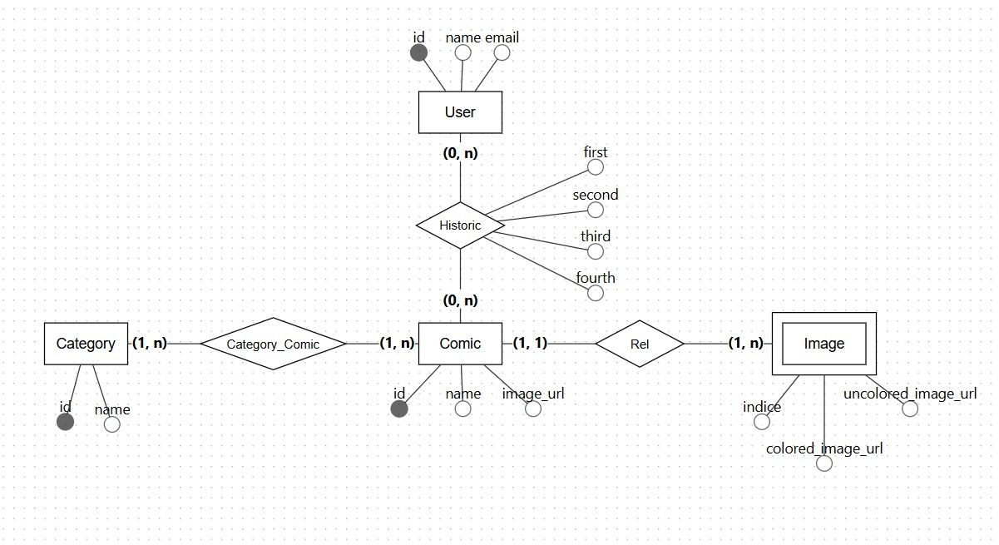
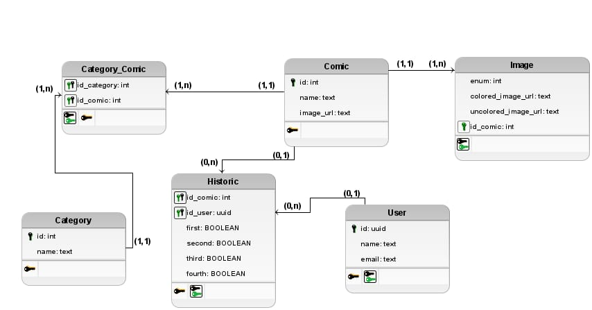
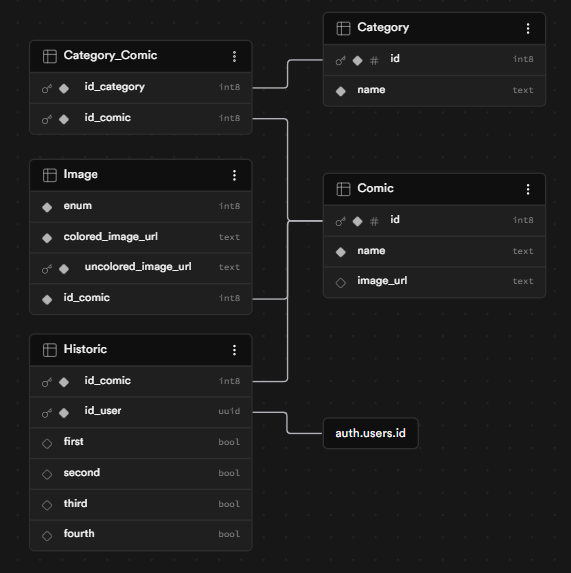
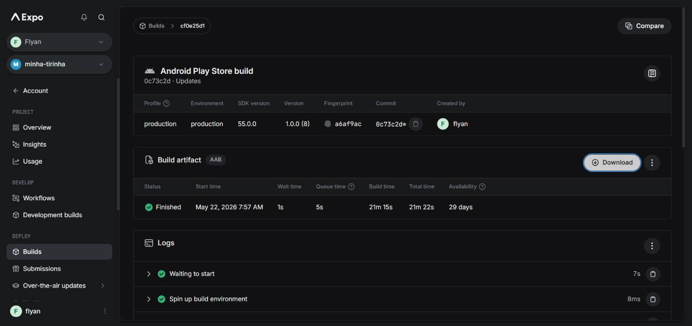
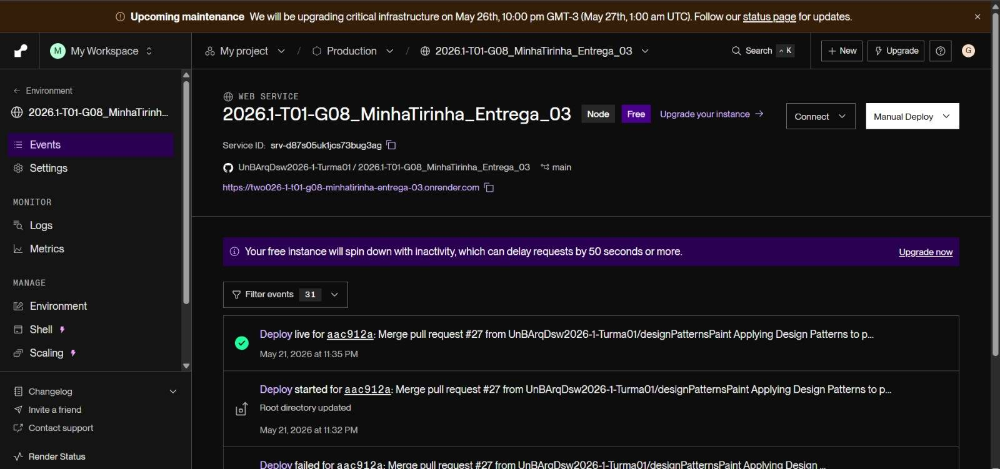

# 3.5. Iniciativas Extras (Padrões de Projeto)

## Banco de Dados
Fizemos diagramas relacional e lógico do banco de dados além do código físico.
**Diagrama Relacional:**

*Feito por Guilherme Flyan*

**Diagrama Lógico de Dados:**

*Feito por Davi Negreiros*

**Físico:**
```sql
CREATE TABLE public.Category (
  id bigint GENERATED ALWAYS AS IDENTITY NOT NULL,
  name text NOT NULL,
  CONSTRAINT Category_pkey PRIMARY KEY (id)
);
CREATE TABLE public.Category_Comic (
  id_category bigint NOT NULL,
  id_comic bigint NOT NULL,
  CONSTRAINT Category_Comic_pkey PRIMARY KEY (id_category, id_comic),
  CONSTRAINT Category_Comic_id_category_fkey FOREIGN KEY (id_category) REFERENCES public.Category(id),
  CONSTRAINT Category_Comic_id_comic_fkey FOREIGN KEY (id_comic) REFERENCES public.Comic(id)
);
CREATE TABLE public.Comic (
  id bigint GENERATED ALWAYS AS IDENTITY NOT NULL,
  name text NOT NULL,
  image_url text,
  CONSTRAINT Comic_pkey PRIMARY KEY (id)
);
CREATE TABLE public.Historic (
  id_comic bigint NOT NULL,
  id_user uuid NOT NULL DEFAULT auth.uid(),
  first boolean DEFAULT false,
  second boolean DEFAULT false,
  third boolean DEFAULT false,
  fourth boolean DEFAULT false,
  CONSTRAINT Historic_pkey PRIMARY KEY (id_comic, id_user),
  CONSTRAINT Historic_id_comic_fkey FOREIGN KEY (id_comic) REFERENCES public.Comic(id),
  CONSTRAINT Historic_id_user_fkey FOREIGN KEY (id_user) REFERENCES auth.users(id)
);
CREATE TABLE public.Image (
  enum bigint NOT NULL,
  colored_image_url text NOT NULL,
  uncolored_image_url text NOT NULL,
  id_comic bigint NOT NULL,
  CONSTRAINT Image_pkey PRIMARY KEY (uncolored_image_url),
  CONSTRAINT Image_id_comic_fkey FOREIGN KEY (id_comic) REFERENCES public.Comic(id)
);
```
Rodando no supabase:

*Feito por Davi Negreiros*

## Deploy
Foi realizado o deploy do aplicativo completo.
**Deploy Frontend:**
O deploy do Frontend foi feito a partir do Expo EAS:

[link do deploy do Frontend do MinhaTirinha](https://expo.dev/artifacts/eas/ryWYDyuxkR7cmVG8mW12q4.aab)
*Feito por Guilherme Flyan*

**Deploy Backend:**
O deploy do Backend foi feito a partir do Render:

[link do deploy do Backend do MinhaTirinha](https://two026-1-t01-g08-minhatirinha-entrega-03.onrender.com)
*Feito por Guilherme Flyan*

