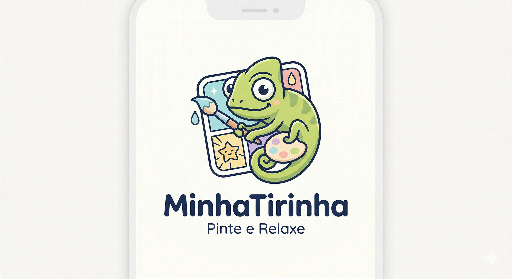

  
  
<b>MinhaTirinha - G08</b>

- [Home](/)
<!-- - [Projetos](/Projeto/Projeto.md) -->

<!-- * [**Página Inicial**](README) -->

* **3. Padrões de Projeto**
    * [3. Padrões](PadroesDeProjeto/3.PadroesDeProjeto.md)
    * [3.1.Padrões Criacionais](PadroesDeProjeto/3.1.GoFsCriacionais.md)
    * [3.2. Padrões Estruturais](PadroesDeProjeto/3.2.GoFsEstruturais.md)
    * [3.3. Padrões Comportamentais](PadroesDeProjeto/3.3.GoFsComportamentais.md)
    * [3.4. Participações](PadroesDeProjeto/3.4.ParticipacoesPadroes.md)
    * [3.5. Iniciativas Extras](PadroesDeProjeto/3.5.IniciativasExtras.md)

- **Atas de Reunião**
  - [Ata de Reunião 04](/Atas/AtaReuniao04.md)

<!-- * **Engenharia de Requisitos**
    * [Lista de Requisitos](Requistos.md) -->

---
* [GitHub](https://github.com/UnBArqDsw2026-1-Turma01/2026.1-T01-G08_MinhaTirinha_Entrega_03)
